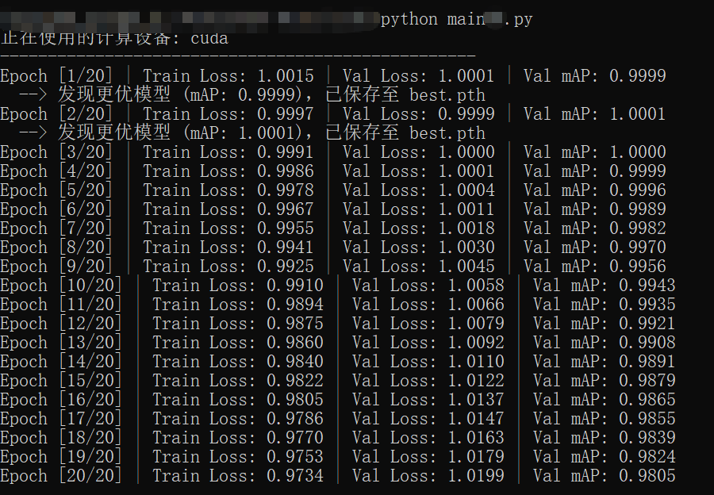

# 炼器启蒙（三）


### ▸ 目录

- [1.3.5 鉴灵明镜：构建剥离梯度的评估模式](#section-001)
- [1.3.6 开炉：让训练的齿轮转动起来](#section-002)
- [1.3.7 初试锋芒：训练测试与模型使用](#section-003)

---

<a id="section-001"></a>
### 1.3.5 鉴灵明镜：构建剥离梯度的评估模式

验证与评估指标的计算，在本章中暂时通过一个方法来实现，后续我们再逐步将其重构为一个类。

验证与评估指标计算的方法evaluate代码如下，请弄明白各行代码的具体意义后，在您的IDE中敲下它们：

```python
def evaluate(model, val_dataloader, criterion, device):
    model.eval()
    total_loss = 0.0    #定义累计损失，初始化为0
    with torch.no_grad():
        for images, targets in val_dataloader:
            images = images.to(device)
            targets = targets.to(device)
            outputs = model(images)
            loss = criterion(outputs, targets)
            total_loss += loss.item()
    avg_loss = total_loss / len(dataloader)
    mock_map = 1.0 / (avg_loss + 1e-6)
    return avg_loss, mock_map
```

我们要将验证数据传给模型（极简目标检测模型），然后基于模型的预测结果计算loss以及其他相关的评估指标，所以，evaluate方法的参数至少有三个，即模型model、验证数据提供工具val\_ dataloader，loss计算方法criterion，除此之外，我们还传入了一个设备参数device，表明是使用CPU还是GPU进行计算，稍后上述这些计算，都将在device指定的设备上进行。

因为是评估模型，所以第一步就需要将模型设置为评估模式，即调用模型的eval方法。

```python
model.eval()
```

模型的eval方法会关闭Dropout层，并冻结 BatchNorm层的均值和方差更新，确保测试时的稳定性。

Dropout层或者叫Dropout操作，会以概率 p（比如0.5）随机将某一层的一部分神经元的输出强制置为 0（失活）,这么做的目的是逼迫网络不能过度依赖某几个特定的“天才”神经元来提取特征，而是让所有神经元都学会独当一面，防止网络过拟合，增强模型泛化能力。BatchNorm层通常以独立的模块出现在神经网络的结构中，他的操作过程是将输入数据减去均值，除以标准差，再进行线性平移和缩放，目的为了让极其深层的网络能够稳定、快速地收敛。

说白了，我们的核心思路就是：训练时需要网络是动态的、不断自我调整的（Dropout随机丢弃，BN波动），这能让模型更强壮。预测时，我们需要网络是静态的、确定无疑的，只有这样才能保证同一个输入永远对应相同的输出。所以训练时要开启Dropout操作，而验证评估的时候，包括使用模型预测的时候，自然就要关闭Dropout操作，否则输出就不稳定了。

也许细心的你会发现，SimpleDetector模型结构中根本就没有Dropout层和BatchNorm层，那调不调用eval方法有什么意义呢？确实，在我们构建的这个极简检测模型中，是否调用eval方法并没有任何影响，但是后续如果我们构建更复杂的模型结构，在预测或者评估时，通过调用eval方法关闭Dropout操作、冻结BatchNorm层的均值和方差更新，会非常重要。因此现在我们就应该养成良好的防御性编程习惯。在评估模式下，即便不发挥实际作用只是一个eval占位符，他也应该被写上。

接下来，因为模型验证阶段不需要反向传播、更新权重，所以我们通过torch的torch.no_grad方法，来禁用 PyTorch 的计算图和梯度跟踪机制，这会大大减少模型验证阶段的内存消耗。

```python
with torch.no_grad()
```

顺带说一下，with是python的原生关键字，他包含了一段代码块。with关键字的核心含义是：在这个代码块执行之前，准备好环境，在这个代码块执行完毕（或发生报错）之后，自动把环境恢复原样。所以with torch.no_grad()这句代码的含义是，在执行下面这段代码之前，禁用 PyTorch的计算图和梯度跟踪机制，因为接下来的代码就是要做模型验证了，模型验证完毕后，正常启用PyTorch的计算图和梯度跟踪机制。

     for images, targets in val_dataloader:
         images = images.to(device)
         targets = targets.to(device)
         outputs = model(images)
         loss = criterion(outputs, targets)
         total_loss += loss.item()

以上代码通过一个循环，从验证数据提供工具val_dataloader中依次获取一个batch_size的图像和标注目标（images、targets），并在指定的设备上让模型预测输入的图像，得到预测值outputs，通过loss计算函数criterion计算预测值outputs和真实标注值targets之间的差异得到loss，通过累加来计算total_loss。如果理解了神经网络的底层逻辑，这一部分非常好理解。

不知道您发现没有，在使用模型预测输入图像的时候，我们没有调用模型的forward方法，我们的代码是这样写的：

```python
outputs = model(images)
```

要知道，参数model传入的是一个模型的实例，对于我们现在的代码而言，也就是传入了一个SimpleDetector类的实例。为什么我们能像使用一个方法（函数）一样使用模型的实例呢？而且还就真的能调用到模型的forward方法，完成模型对图像的预测处理（前向传播）？

如果你非常熟悉python语言，很自然的就会想到这是python的\_\_call\_\_方法在起作用。在python语言中，当你在一个类中实现了\_\_call\_\_方法，那么这个类的实例对象能够像函数一样被带上括号直接调用，他实际调用的就是\_\_call\_\_方法。SimpleDetector类继承自nn.Module，而nn.Module中实现了\_\_call\_\_方法，而且在\_\_call\_\_方法中，调用了自身的forward方法，就是这个原因，我们可以通过model(images)，来实现模型的前向传播完成图像的预测。想要更进一步了解nn.Module的\_\_call\_\_方法，可以查阅相关资料或阅读nn.Module的源码，本文不再赘述。

接下来，就是计算平均损失avg_loss和mAP,当然这里的mAP不是真实的，因为loss越小，mAP就应该越高，所以我们用loss的倒数来模拟mAP，为了防止loss为0出现错误，我们在分母上加了一个极小的常数1e-6，这也是防御性编程。

        map = 1.0 / (avg_loss + 1e-6)

<a id="section-002"></a>
### 1.3.6 开炉：让训练的齿轮转动起来

现在，我们可以来实现训练循环了。同样，模型训练在本章中暂时使用一个方法来实现，后续我们再逐步将其重构为一个类。

在train_model方法中，我们首先确定模型计算所使用的设备。通常我们的计算设备有CPU或者GPU两类，对于张量计算，推荐用GPU，如果没有，也可以使用CPU。为了兼容这两种情况，我们首先要判断本机上到底有没有可用的GPU，有则用之，没有就使用CPU。

```python
device = torch.device("cuda" if torch.cuda.is_available() else "cpu")
```

我们通过torch.cuda.is_available()来判断本机的GPU是否可用，如不可用，则使用CPU，并通过torch.device方法来构建对应的设备对象。

然后，设定网络训练的超参数。

        img_size = 256     # 设定网络输入的图像大小，与数据集对应
        num_classes = 2     # 设定模型需要检测的物体类别总数，与数据集对应
        batch_size = 4      # 设定 DataLoader 每次打包送入网络的样本数量
        num_epochs = 20      # 设定模型需要遍历整个训练数据集的轮数

这里img_size和num_classes要与我们刚刚SimpleFakedDataset类中设定的图像大小和目标类别数量一致。当然，就图像大小而言，更完善的卷积网络库会将实际图像的大小，处理（缩放）成与训练超参数中设定的大小一致，所以倒未必要求img_size超参数一定与数据集中图像的大小一致。

batch_size是指DataLoader每次从数据集，准确的说是训练集中，取多少数据组合在一起送入网络进行训练，我们这里设定的是4，也就是每次送入模型训练的是4张图片。刚刚，我们默认设定的训练集图像数量是100，那么也就是100/4=25个批次后，训练集中的所有图片都会被送入模型进行一次训练，这就叫一个epoch。训练集中的图片都送入模型进行一次训练，就叫一个epoch。当然，仅让模型把所有训练图片过一遍是不够的，需要反复训练，反复多少次呢？这就由num_epochs超参数设定，我们这里设定的是20次。真实模型的训练，要根据数据集的大小，数据集中图片的重复程度来设定，一般在100到300之间。

再来，设定训练结果，也就是模型权重文件的保存位置，代码如下：

        save_dir = "weights"
        os.makedirs(save_dir, exist_ok=True)

我们在main.py文件的根目录下创建一个子文件夹“weights”，用来保存模型的权重文件，权重文件通常是一个pt文件。

os.makedirs(save_dir, exist_ok=True)，是我们基于os库，判断“weights”文件夹是否存在，如果不存在，就要创建它。

接下来，就该准备训练数据了。

        train_dataset = SimpleFakeDataset(num_samples=100,img_size=img_size, num_classes=num_classes)
        val_dataset = SimpleFakeDataset(num_samples=20, img_size=img_size, num_classes=num_classes)

        train_loader = DataLoader(train_dataset, batch_size=batch_size, shuffle=True)
        val_loader = DataLoader(val_dataset, batch_size=batch_size, shuffle=False)

我们先实例化两个SimpleFakeDataset对象，train_dataset用来训练模型，包含100张图像；val_dataset用来验证模型，包含20张图像。当然，这个图像数量可以根据你的需要来调整。

然后我们基于训练数据集和验证数据集，构建两个数据供给工具，即Dataloader对象，Dataloader使用pytorch提供的基础Dataloader类。Shuffle参数设定为True，表示要求Dataloader在每个epoch开始的时候随机打乱数据集中的图像顺序，这样可以保证每个epoch给模型喂入训练数据的顺序是随机的。训练的时候，我们一般要求Dataloader打乱顺序，验证的时候，则不一定要有这个要求，所以在val_loader中，Shuffle参数设定为False。

接下来就是构建模型，我们已经构建了模型类SimpleDetector，在这里只要将这个类实例化并将其所有参数（模型的权重、偏置等参数）通过to(device)方法传递到我们选定的计算设备上就可以了。

```python
model = SimpleDetector(num_classes=num_classes).to(device)
```

也许有人会问，模型的初始参数是怎么设定的呢？在SimpleDetector的初始化方法里，当我们调用nn.Conv2d等模块创建网络结构的时候，就是在构建nn.Conv2d对象，会调用nn.Conv2的reset_parameters()方法，该方法会使用Kaiming均匀初始化策略（He初始化），初始化模型的所有参数。Kaiming初始化的核心思想是让每一层输出的方差，尽可能等于输入的方差。如果有兴趣可以自行查阅相关的资料，本文对此话题不进行深入的探讨。

接下来，就是定义六大核心逻辑里的loss计算方法和优化方法。

        criterion = nn.MSELoss()
        optimizer = optim.Adam(model.parameters(), lr=1e-3)

为简单起见，我们这里直接使用pytorch提供的MSELoss方法和Adam优化器。Adam优化器有两个参数，一个是模型参数，通过model.parameters方法获取，一个是学习率lr，学习率就是优化器每一次调整模型参数时的幅度，很容易理解，这个调整幅度不能太大，否则网络参数就会来回振荡，这里将lr设定为0.001

当然，我们还需要定义一个变量来记录截至目前模型最优的评估指标，当有更优秀的评估指标出现时，我们就要把对应的最优模型保存起来，初始值我们设定为0：

```python
best_mock_map = 0.0
```

这是在开始进入训练循环前我们要做的所有工作，具体的代码如下，请弄明白各行代码的具体意义后，在您的IDE中敲下它们：

```python
def train_model():
    device = torch.device("cuda" if torch.cuda.is_available() else "cpu")
    print(f"正在使用的计算设备: {device}") # 在控制台打印当前使用的计算设备

    img_size = 256      # 设定网络输入的图像分辨率大小
    num_classes = 2     # 设定模型需要检测的物体类别总数
    batch_size = 4      # 设定 DataLoader 每次打包送入网络的样本数量
    num_epochs = 20      # 设定模型需要遍历整个训练数据集的轮数

    save_dir = "weights"
    os.makedirs(save_dir, exist_ok=True)

    train_dataset = SimpleFakeDataset(num_samples=80, img_size=img_size, num_classes=num_classes)
    val_dataset = SimpleFakeDataset(num_samples=20, img_size=img_size, num_classes=num_classes)

    train_loader = DataLoader(train_dataset, batch_size=batch_size, shuffle=True)
    val_loader = DataLoader(val_dataset, batch_size=batch_size, shuffle=False)

    model = SimpleDetector(num_classes=num_classes).to(device)
    criterion = nn.MSELoss()
    optimizer = optim.Adam(model.parameters(), lr=1e-3)
    best_mock_map = 0.0
    print("-" * 50) # 打印分割线，使输出日志更加美观清晰
```

接下来，就开始正式的进入训练循环的编码。训练循环的具体代码如下，请弄明白各行代码的具体意义后，在您的IDE中敲下它们：

```python
for epoch in range(num_epochs):
        model.train()
        train_total_loss = 0.0
        for batch_idx, (images, targets) in enumerate(train_loader):
            images = images.to(device) #将当前批次的训练图像转移到计算设备上
            targets = targets.to(device) #将当前批次的标注信息转移到计算设备上
            optimizer.zero_grad() #清空优化器中记录的上一轮梯度
            predictions = model(images)
            loss = criterion(predictions, targets)
            loss.backward()
            optimizer.step()
            train_total_loss += loss.item()

```

首先根据设定的训练epoch数（num_epochs）构建主循环：

```python
for epoch in range(num_epochs)
```

设定模型模式为训练模式，并定义train_total_loss变量用于记录训练总loss,初值为0：

```python
model.train()
        train_total_loss = 0.0
```

调用model.train()的作用，就是激活之前提到的Dropout和 BatchNorm，当然我们的模型中没有Dropout和 BatchNorm，所以这里也是防御性编程的一种，再次强调，请务必养成这个习惯。

接下来，基于train_loader设定内循环，在这个循环中，我们把train_loader按批次大小（batch_size）提供的训练数据送入模型，得到预测结果，再根据loss计算方法计算loss,最后用优化器优化模型参数。

```python
for batch_idx, (images, targets) in enumerate(train_loader):
            images = images.to(device)
            targets = targets.to(device)
            optimizer.zero_grad()
            predictions = model(images) # 前向传播
            loss = criterion(predictions, targets) # 计算loss
            loss.backward() # 反向传播
            optimizer.step()
            train_total_loss += loss.item()
```

这里，我们使用python的enumerate方法对train_loader进行了包装，这样我们除了能从train_loader中获得我们需要的数据(images, targets)，还能够基于enumerate的自动计数功能，获取数据的索引batch_idx，知道了批次索引，我们就知道了当前epoch中，我们进行到哪个批次了，因为总批次等于训练集中的图像数量除以batch_size ,还记得吧，这样稍后我们要做每一个epoch进度条，估计当前epoch的剩余训练时间，就都有了依据。

optimizer.zero_grad()是为了清空优化器中保存的上一轮训练时的梯度信息，否则每个batch的梯度数据会被累加，导致训练出现错误。我们只想利用当前batch的梯度数据来更新模型的参数，至于之前那个batch的梯度数据，已经用过就不再需要了，否则梯度一直累加，多轮训练下来梯度就炸了。所以optimizer的zero_grad方法是一定要调用的。

optimizer.step()方法的作用，是优化器根据当前批次的数据计算出的梯度，向损失降低的方向调整网络权重。

train_total_loss += loss.item()是计算当前epoch的总损失，稍后方便将当前epoch的总损失显示给用户，loss.item()是获取loss张量中的python标量值。

当每个epoch的训练结束，也就是训练集中的所有图片都用过一轮以后，我们的模型也经过了一轮优化，这时候我们要计算当前 epoch 训练集上的平均损失:

```python
train_avg_loss = train_total_loss / len(train_loader)
```

train_avg_loss代表了在这个 Epoch中，模型在“平均每一个 Batch”上产生的误差大小, 用来衡量模型在当前这一轮训练中的整体表现。

那么这个train_avg_loss和每一个批次（注意想清楚批次的含义，不要和epoch搞混）上的loss有什么不同呢？

批次内计算出来的loss （loss = criterion(predictions, targets)），代表模型在当前这几张图片（比如我们这里batch_size=4，也就是训练集中的随机4张图片）上的表现。由于图片是随机的，有的批次的4张图片难辨认，有的批次的4张图片容易辨认，所以批次内计算出来的loss可能是跳跃的，我们无法通过这个loss来判断模型到底是在变聪明，还是在瞎猜。为了消除这种由于数据随机性带来的“局部震荡”，我们需要计算一个整体的平均成绩，也就是我们不看模型在一个batch上的表现，而要看模型在整个epoch上的表现，也就是这个train_avg_loss。

有人也许会问，为什么分母是DataLoader的长度（Batch的总数），而不是Dataset的长度（即训练集图片的总量）？这是因为PyTorch中的损失函数（Criterion）默认已经把这一个batch里所有图片（比如我们这里的4张图）的误差求过一次平均值了，所以loss.item()获得的那个纯数字，含义就是“当前这个batch中，平均每张图片的误差”。因此，我们在计算train_avg_loss时，分母就应该是batch的总数，而不是训练集图片的总量。

然后，我们就需要调用验证评估方法，来评估一下经过最新优化后的模型的实际效果了。

```python
val_avg_loss, val_mock_map = evaluate(model, val_loader, criterion, device)
```

我们调用evaluate方法，获取模型的评估指标，val_avg_loss, val_mock_map，然后我们把这些评估指标显示给用户。

```python
print(f"Epoch [{epoch+1}/{num_epochs}] "
              f"| Train Loss: {train_avg_loss:.4f} "
              f"| Val Loss: {val_avg_loss:.4f} "
              f"| Val mAP: {val_mock_map:.4f}")
```

我们显示的指标主要是当前轮次数、平均训练损失rain_avg_loss、平均验证损失val_avg_loss以及mAP。

训练过程中，我们当然要把训练好的模型保存下来。一般来讲，每个epoch训练结束，都要把训练后的模型保存下来，叫last.pt，同时，我们根据验证指标，会将最优的模型保存下来，叫best.pt。这两个模型未必是一致的，因为模型训练中会发生振荡，并不是最后一个epoch得到的模型就是最好的。

模型的保存代码如下，请弄明白各行代码的具体意义后，在您的IDE中敲下它们：

```python
#保存当前 epoch 训练结束时的模型状态参数
current_save_path = os.path.join(save_dir, f"last.pth")
        torch.save(model.state_dict(), current_save_path)#保存模型
		#根据当前 epoch 验证集上的评估指标，保存最优模型
        if val_mock_map > best_mock_map:#如果是到当前为止最优的指标
            best_mock_map = val_mock_map
            print(f"  --> 发现更优模型 (mAP: {best_mock_map:.4f})，已保存至 best.pth")
            best_save_path = os.path.join(save_dir, "best.pth")
            torch.save(model.state_dict(), best_save_path)#保存模型
```

保存模型使用的是torch.save方法，他接受两个参数，一个是模型的状态字典model.state_dict()，一个是保存位置。一般而言，我们在保存模型时，只需要保存模型的状态也就是模型的参数就行，不需要保存模型的具体结构以及其他一些信息，我们只需要在使用模型时保持模型结构一致就可以了，这样可以大幅度减少保存文件的大小。

最后的最后，我们写一个python的入口代码：

```python
# Python 脚本的标准执行入口
if __name__ == "__main__":
    train_model()
```

<a id="section-003"></a>
### 1.3.7 初试锋芒：训练测试与模型使用

恭喜你，这个基础版的卷据网络模型你已经写完了。

虽然它只能拟合一堆随机数，网络的深度看起来也不是很深，但全世界所有最顶尖的进行目标识别的卷积网络模型的底层运转逻辑，跟这120行左右的代码没有任何本质区别。

**1、训练测试**

是时候来看看我们的成果了。

请再次核对每一行代码，确保没有包括拼写错误在内的任何错误，然后你就可以在你的python运行终端输入python main.py来运行这段代码了。

如果不出意外的话，您会看到训练从Epoch 1进行到Epoch 20，loss呈现下降的趋势，mAP呈现上升的趋势，当然loss和mAP大概率会是振荡的，因为我们是基于随机数在进行真正的训练。训练过程中会根据mAP保存评估效果最佳的模型为best.pt，每一个Epoch都会保存一个last.pt，当然，新的last.pt会覆盖旧的last.pt，所以在根目录下的weights文件夹内，你始终只会看到最新的那一个last.pt。

控制台的输出如下图所示。

<p align="center">
  
</p>


**2、模型使用**

对于训练出来的最优模型best.pt,你也可以尝试使用他，感受一下使用模型的过程。虽然这个模型目前并没有实际的作用，因为他是基于随机生成的虚拟数据训练出来的。

要使用训练出来的模型，必须使用我们定义的SimpleDetector类，以确保模型结构完全一致。然后我们创建SimpleDetector模型对象，加载best.pt，虚拟一张图像并送入模型预测，查看预测结果。

具体代码如下：

```python
import os # 导入操作系统接口，用于路径检查
import torch # 导入 PyTorch 核心计算库
import torch.nn as nn # 导入神经网络模块
# 必须先准备好一模一样的模型结构
class SimpleDetector(nn.Module):
    # 推理时，模型的网络结构、层数、通道数必须与训练时完全一致
    def __init__(self, num_classes=2):
        super().__init__()
        self.out_channels = num_classes + 8

        self.backbone = nn.Sequential(
            nn.Conv2d(3, 16, 3, stride=2, padding=1),
            nn.ReLU(),
            nn.Conv2d(16, 32, 3, stride=2, padding=1),
            nn.ReLU(),
            nn.Conv2d(32, 64, 3, stride=2, padding=1),
            nn.ReLU(),
        )
        self.head = nn.Conv2d(64, self.out_channels, kernel_size=1)

    def forward(self, x):
        return self.head(self.backbone(x))
if __name__ == "__main__":
    device = torch.device("cuda" if torch.cuda.is_available() else "cpu")
    print(f"推理使用的设备: {device}")
    model = SimpleDetector(num_classes=2)    # 创建一个未经过训练的、权重随机初始化的“空”模型
    weights_path = "weights/best.pth" # 权重文件路径
    # 加载权重
    model.load_state_dict(torch.load(weights_path, map_location=device))
    print(f"成功加载模型权重: {weights_path}")
    model.to(device) # 将装载好权重的模型移动到指定的计算设备上
    model.eval()
    single_image = torch.randn(1,3,256,256).to(device) # 准备待预测的图像
  	with torch.no_grad():
        prediction = model(single_image)
    print(f"输入图像形状: {single_image.shape}")
    print(f"预测结果形状: {prediction.shape}")
```

这段代码所涉及到的内容在上文中都已经详细解释过了，请你自行分析每句代码的含义，并尝试运行。
