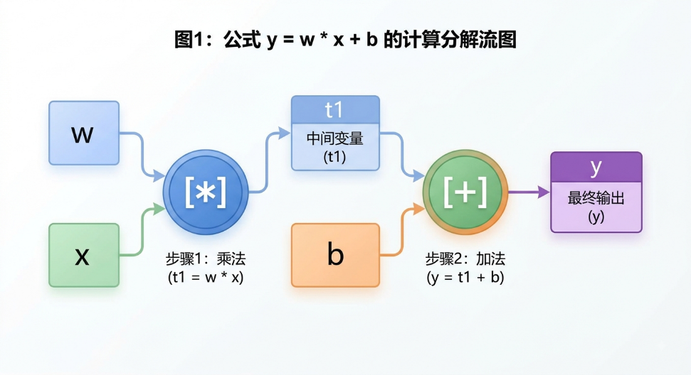
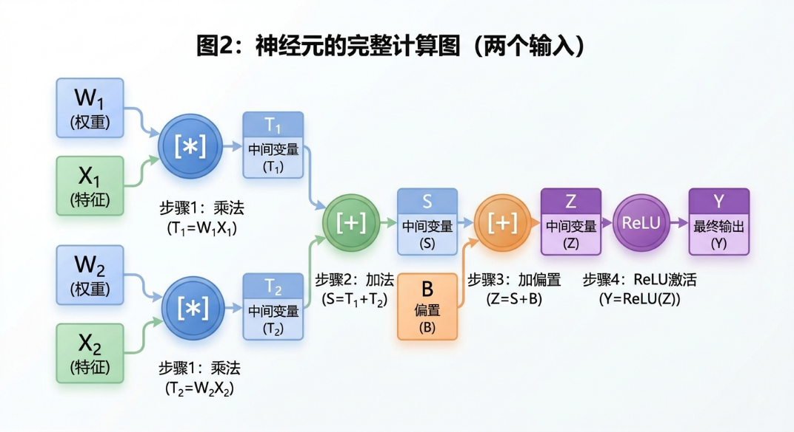
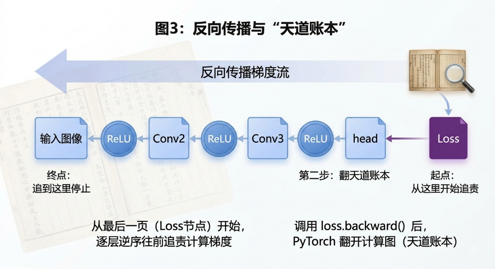
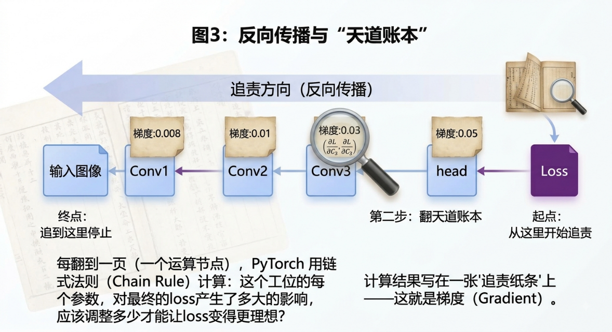

# 万物 | 炼器  —— 计算图、梯度与反向传播（一）


***

回顾第1卷，我们以一根"烧火棍"——三层卷积加一个 1×1 检测头——跑通了深度学习的完整闭环。那时我们写下了五行“神咒”：

```python
optimizer.zero_grad()
predictions = model(images)
loss = criterion(predictions, targets)
loss.backward()
optimizer.step()
```

彼时，我们只知道"念了咒模型就能变得更好"，却不知其中奥义。这几行代码究竟做了什么？为什么 loss.backward() 一声令下，网络模型中成千上万的参数就知道自己该往哪个方向调整？

本卷，我们将揭开“造化重锤”的面纱，从计算图、梯度、反向传播这三大法则入手，彻底看清深度学习"为什么能学"的底层机理。然后，我们再将第1卷的单尺度烧火棍升级为三尺度 FPN 检测器——一件真正具有"远近皆视"能力的初级法器。

## 2.1 天道法眼 ── 计算图的直觉

天道昭昭，疏而不漏。在深度学习的世界里，也有这样一双天道法眼——计算图（Computational Graph）。它默默注视着网络模型从第一层向最后一层计算（前向传播）的每一步，记录下每一次的乘法、加法、激活函数……待到 Loss 出炉，backward那一刻，天道法眼便沿着记录的路径，逆流而上，将"纠错信号"精准地分发给每一个参数。

这一节，我们从零开始，建立对计算图、前向传播、反向传播、梯度下降的完整直觉。

<a id="section-001"></a>

### 2.1.1 有向无环图：初识计算图

在数学中，我们通常把一系列的运算写成一个计算公式，比如：

$$
y = w \cdot x + b
$$

对人工神经网络稍有了解的读者，应该很熟悉这个公式。这个看似平凡的公式，其实可以拆成三步：

1.  **步骤 1：** $t_1 = w \cdot x$（乘法）
2.  **步骤 2：** $t_2 = t_1 + b$（加法）
3.  **步骤 3：** $y = t_2$（输出）

画成图就是：

<p align="center">
  
</p>

这张图有两个特征：

1.  有方向——箭头从输入指向输出，信息只往前流，不会往回走。

2.  无环路——没有任何箭头能绕回自己，不会出现"鸡生蛋、蛋生鸡"的循环。

这就是有向无环图（DAG, Directed Acyclic Graph）。深度学习中的"计算图"就是这样一张 DAG。

也许有人会问："这不就是小学算术吗？为什么要搞得这么隆重？"

答案是：当公式变得极其复杂，比如一个包含数百万参数的神经网络，其每一个节点（神经元）都会进行这样的运算，这个时候，靠人脑已经无法追踪每个运算的来龙去脉。此时，计算图就像一张精密的"账本"，把每一步运算都记录在案。有了这张账本，PyTorch 就能自动计算出任意参数（比如每一步运算中的w和b）对最终 Loss 的影响。

这就是自动微分（Autograd）的基础。

<a id="section-002"></a>

### 2.1.2 微观解剖：一个神经元的计算图

第1卷中，我们已经直接使用了 PyTorch库提供的基础网络模块nn.Conv2d。它很好用，像一台现成的“法阵”，图像丢进去，特征吐出来，省心省力。但问题也来了：法阵是会运转了，可里面的造化之火从哪里来？神经网络中所谓的“权重”和“偏置”到底是什么？为什么 loss.backward() 之后，它们就知道自己该怎么改？

要回答这些问题，我们先不急着拆解卷积层。

卷积层虽然常见，但它涉及局部窗口、滑动计算、权重共享等概念，一上来就拆解它，容易像刚学握剑就被拉去御剑飞行，风景很好，人也很晕。

我们先回到最基础的单元：一个普通神经元（Neuron）。

一个神经元最朴素的结构是：

> 若干输入 → 加权求和 → 加偏置 → 激活函数 → 输出

如果输入有两个值 x1 和 x2，对应权重是 w1 和 w2，偏置是 b，那么这个最基本的神经元的计算过程可以写成：

$$
\begin{aligned}
t_1 &= w_1 \cdot x_1 \\
t_2 &= w_2 \cdot x_2 \\
s &= t_1 + t_2 \\
z &= s + b \\
y &= \mathrm{ReLU}(z)
\end{aligned}
$$

合在一起就是：

$$
y = \mathrm{ReLU}(w_1\cdot x_1 + w_2\cdot x_2 + b)
$$

这就是一个神经元的完整小宇宙：输入进来，权重衡量重要性，偏置调整触发基线，激活函数决定信号是否继续往后传。

#### 1、权重w（Weights）：可调节的旋钮 

想象你面前有一台调音台。调音台上有很多推杆，每个推杆控制一个音轨的音量。神经网络中的权重，就是这些推杆。

某个音轨的权重大，说明这个输入声音大、分量重；

某个权重接近 0，说明这个输入几乎被忽略；

某个权重是负数，说明这个输入会产生反向影响。

比如：

$$
\begin{aligned}
x_1 &= 2.0 \\
x_2 &= -1.0 \\
w_1 &= 0.8 \\
w_2 &= -0.4
\end{aligned}
$$

那么：

$$
\begin{aligned}
t_1 &= w_1 \cdot x_1 = 0.8 \cdot 2.0 = 1.6 \\
t_2 &= w_2 \cdot x_2 = -0.4 \cdot -1.0 = 0.4 \\
s &= t_1 + t_2 = 2.0
\end{aligned}
$$

训练刚开始时，权重（推杆位置）通常是随机设定的。这时神经元还像一个刚入门的调音学徒，推杆推到什么位置全凭缘分，输出自然不太靠谱。训练的本质，就是通过一次次“播放声音—挨批评—改参数”，把这些权重（推杆）逐渐调到合适的位置。

#### 2、偏置b（Bias）：灵敏度基线

除了权重，神经元通常还有一个偏置 b。

继续上面的例子，假设：

$$
b = -0.5
$$

那么：

$$
z = s + b = 2.0 - 0.5 = 1.5
$$

偏置可以理解成神经元的“触发基线”或者“灵敏度基线”。

用烟雾报警器来比喻：

- 权重：决定它对不同气体成分有多敏感

- 偏置：决定它整体有多容易报警

- 激活函数：决定它最后到底响不响

在 ReLU 这类激活函数下，偏置越大，z 越容易变成正数，神经元越容易被激活；偏置越小，神经元越谨慎，需要更强的输入信号才会响应。

#### 3、激活函数：给网络一点非线性脾气

如果神经元只会做加权求和，那么无论堆多少层，本质上仍然是一堆线性运算。这样的网络很难处理复杂模式。所以我们需要激活函数。

我们先看最常用的ReLU函数，ReLU函数的定义如下：

$$
\mathrm{ReLU}(z) = \max(0, z)
$$

也就是说：

如果函数的输入z > 0，那么函数输出 z

如果函数的输入 z <= 0，那么函数输出 0

刚才算出：

$$
z = 1.5
$$

所以：

$$
y = \mathrm{ReLU}(1.5) = 1.5
$$

如果某次算出来：

$$
z = -0.7
$$

那么：

$$
y = \mathrm{ReLU}(-0.7) = 0
$$

ReLU 就像一个很直爽的守门人，正数可以过，负数先原地冷静。

#### 4、一个神经元的完整计算图

现在，我们把刚才那个最基本的神经元的计算图画出来。

<p align="center">
  
</p>

用数学公式写就是：

$$
\begin{aligned}
t_1 &= w_1 \cdot x_1 \\
t_2 &= w_2 \cdot x_2 \\
s &= t_1 + t_2 \\
z &= s + b \\
a &= \mathrm{ReLU}(z) = \max(0, z)
\end{aligned}
$$

在这张计算图中，x1, x2是输入数据，w1, w2, b是需要学习的参数，\[\*]是乘法节点，\[+]是加法节点，\[ReLU]是激活函数节点，y是神经元输出。

这就是神经元级别的计算图。前向传播时，数据从左往右流动，依次算出 t1、t2、s、z、y。反向传播时，梯度从右往左流动，沿着同一张图倒着追责，计算 w1、w2、b 分别对最终 Loss 产生了多大影响。也就是说，计算图不仅记录“结果怎么算出来”，还记录“出问题以后该往哪里追”。

也许有人会问：“第1卷不是用了 nn.Conv2d 吗？卷积层和这里神经元的计算图一样吗？”答案是：不完全一样，但底层精神一致。

普通神经元通常接受一组输入，做一次加权求和。

卷积层则是通过滑动的方式在图像上反复做很多次局部加权求和。

一个卷积核在某个局部窗口上的计算，本质上仍然离不开：乘法 + 加法 + 偏置。只是卷积层额外多了几个新机制，包括：局部窗口、滑动计算、权重共享、多通道叠加。这些概念会让计算图变得更大、更密，但没有改变计算图的基本规则。

现在我们先把“一个普通神经元”的账本看清楚。等这套追责逻辑站稳了，后面再拆 Conv2d、YOLO模块、OBB检测头时，理解起来就更容易了。

<a id="section-003"></a>

### 2.1.3 组装流水线：前向传播是一条单行道

前向传播（Forward Pass），就是数据从输入端一路经过运算流向输出端的过程。

想象一条工厂流水线。原料（图像）从一端进入，经过若干工位（卷积层、激活函数层……）逐步加工，最终得到成品（预测结果）。

在这条流水线上：

1、数据只往前走——输入图像进入第一层 Conv2d，输出结果进入第一个 ReLU，ReLU 的输出进入第二层 Conv2d……绝不回头。

2、PyTorch 默默记录——每经过一个工位，PyTorch 的 Autograd 引擎就在计算图上添加一个节点，记录"这一步用了什么运算、输入是什么、参数是什么"。

前向传播结束后，我们得到了两样东西：

1、预测结果（predictions）—— 成品。

2、一张完整的计算图——天道法眼的账本，记录了从原料到成品的每一道工序的细节。

我们可以用代码来验证 PyTorch 确实在记录计算图，在一个python文件中，输入以下代码：

```python
import torch
import torch.nn as nn

# 一个最简单的线性层
linear = nn.Linear(3, 1)

#构造一个随机的张量作为输入
x = torch.randn(1, 3)

# 前向传播
y = linear(x)

# y 记住了自己是怎么来的！
print(y.grad_fn)
# 输出类似: <AddmmBackward0 object at 0x...>
```

grad\_fn 就是计算图节点的"身份证"。AddmmBackward0 表示"这个张量是通过矩阵乘法+加法（Addmm）得到的"。PyTorch 通过 grad\_fn 把所有节点串起来，就像账本上的页码。

也许有人会问，能不能关掉这个记录功能？当然可以。这就是 torch.no\_grad() 的作用——告诉 PyTorch "别记账了，省点内存"。当你不想训练模型，只是想使用模型得到推理结果的时候，就需要关掉这个记录功能，第1卷的 evaluate 函数里就用了它：

```python
with torch.no_grad():
    outputs = model(images)  # 不记录计算图，节省内存
```

再啰嗦一句，计算图记录所有前向传播的计算细节，目的是为了后续优化网络参数的时候可以有的放矢，所以计算图存在的目的，是为了训练网络模型，模型训练好以后，推理的时候，一般就不再需要保存计算图了，毕竟还是挺消耗内存的。

<a id="section-004"></a>

### 2.1.4 天道回溯：loss.backward() 的四步机制

法宝的输出（预测结果）到了质检站（Loss 函数），被判为不合格，并且质检站精确的计算出了这一次的输出与标准要求之间的差距（loss）。此时，质检站发出一道追责令，流水线上的每一个工序，都将受到追责令的影响——这就是 loss.backward()。

让我们用"追责"的比喻，拆解 loss.backward() 的四步机制：

第一步：质检站打分

$$
loss = criterion(predictions, targets)
$$

质检站比较输出（predictions）和标准要求（targets），给出一个"不合格程度"分数——Loss 值。Loss 越大，说明偏差越大。

第二步：翻天道账本

loss.backward() 被调用后，PyTorch 翻开计算图（天道账本），从最后一页（Loss 节点）开始，逆序往前翻。

<p align="center">
  
</p>

第三步：分发"追责纸条"（梯度）

每翻到一页（一个运算节点），PyTorch 用链式法则（Chain Rule）计算：这个工位的每个参数，对最终的loss产生了多大的影响，应该调整多少才能让loss变得更理想？计算结果写在一张"追责纸条"上——这就是梯度（Gradient）。

<p align="center">
  
</p>

每个参与当前Loss计算、且 requires\_grad=True的可训练参数，都会收到自己对应的惩罚值（梯度值）。梯度的含义是：如果暂时固定其他参数，只让本参数增加一点点，Loss 会朝什么方向变化、变化得有多快。因此，梯度反映的是参数对 Loss 的影响方向和影响程度。

第四步：将梯度存储在参数的 \`.grad\` 属性中

完成反向传播后，每个参数的梯度被存储在 param.grad 里，之后，优化器就会读取这些梯度，并据此更新模型参数：

```python
loss.backward()

# 现在每个参数都有了梯度
for name, param in model.named_parameters():
    if param.grad is not None:
        print(f"{name}: grad shape={param.grad.shape}")
```

需要额外注意一点：PyTorch 默认会累积梯度。因此正式训练时通常会在下一轮反向传播之前先清空旧梯度：

```python
optimizer.zero_grad()
```

也许有人会问，"链式法则是什么？为什么它能算出每个参数的梯度？"

链式法则是微积分中的一条基本法则。简单来说：如果 y 依赖于 u，u 依赖于 x，那么 y 对 x 的变化率 = y 对 u 的变化率 乘以 u 对 x 的变化率。

$$
dy/dx = dy/du \times du/dx
$$

在计算图中，从 Loss 到某个参数可能经过了很多中间节点，loss的变化，和这些中间节点都有关系。那么根据链式法则，把沿途每一段的"变化率"连乘起来，就得到了从 Loss 到该参数的总变化率——即梯度。

$$
\partial Loss/\partial w_1 = \partial Loss/\partial y \times \partial y/\partial z \times \partial z/\partial s \times \partial s/\partial t_1 \times \partial t_1/\partial w_1
$$

这就像追责令沿着流水线逆流而上，每经过一个工位，就乘上该工位的"传递系数"。最终到达某个参数时，所有传递系数连乘的结果，就是该参数的梯度。

> 💡 **关键洞察**
>
> *越靠近输出端的工位，追责令经过的工位少，梯度计算简单。越靠近输入端的工位，追责令经过的工位多，梯度要连乘很多项。如果中间某些项小于1，连乘后梯度会越来越小——这就是**梯度消失**问题，后续会专门讨论。*

<a id="section-005"></a>

### 2.1.5 蒙眼下山：梯度下降的几何直觉

现在每个参数都有了自己的梯度。接下来该怎么用呢？

想象你蒙着眼睛站在一座山上，目标是走到山谷的最低点（Loss 最小值）。你看不见路，但你能感受脚下地面的坡度——梯度就好比地面坡度的测量结果。

感觉脚下是斜向上的（梯度为正，增加参数值，loss也会增加）→ 你应该往相反的方向走（减小参数值，从而减小loss）。

感觉脚下是斜向下的（梯度为负，增加参数值，loss会减小）→ 你应该往前走（增大参数值，减小loss）。

当然也可能脚下是平的（梯度为零），这意味着你可能到了谷底，也可能到了山顶或鞍点，暂时先不做调整。

这就是梯度下降（Gradient Descent）的几何直觉。

用数学公式表示：

$$
新参数值 = 旧参数值 - 学习率 \times 梯度
$$

或者写成代码的形式：

$$
w_{\mathrm{new}} = w_{\mathrm{old}} - lr \cdot grad
$$

其中学习率（Learning Rate, lr）控制每一步走多远，也就是每一次参数调整的比例：

*   lr 太大 → 步子太大，跨过谷底，在山的两侧来回弹跳（振荡）。

*   lr 太小 → 步子太小，虽然方向对，但走到天荒地老也到不了谷底（训练时间太长）。

*   lr 恰当 → 稳稳地走向谷底。

现在，怎么使用梯度的答案就呼之欲出了。我们只要遵循上述参数调整公式，就能够利用梯度数据，更新模型中的每一个参数了。

当然，山只是一个形象的比喻，真实神经网络实际上有成千上万个参数，loss是由这些参数共同决定的。我们无法绘制出超过3维的图像，但梯度下降的原理完全相同：在每个维度上，朝着让 Loss 减小的方向走一步。只不过在高维空间中，"方向"变成了一个 N 维的向量，即梯度向量。

<a id="section-006"></a>

### 2.1.6 手撕 optimizer.step()

现在让我们亲手实现一个最简单的参数调整，以彻底理解 optimizer.step() 在做什么。

先看 PyTorch 的标准写法（SGD，不带动量）：

```python
optimizer = optim.SGD(model.parameters(), lr=0.01)
optimizer.step()  # 这一行到底做了什么？
```

optimizer.step() 的内部逻辑，等价于：

```python
with torch.no_grad():
    for param in model.parameters():
        if param.grad is not None:
            param -= lr * param.grad
```

就这么简单！让我们一行一行拆解：

第一行：\`with torch.no\_grad():\`

```python
with torch.no_grad():
```

更新参数时不需要记录计算图。因为这一步是"改进工艺"，不是"生产产品"。如果不关掉记录，PyTorch 会把参数更新也记入计算图，造成内存浪费。

第二行：\`for param in model.parameters():\`

        for param in model.parameters():

遍历模型的所有参数。

第三行：\`param -= lr \* param.grad\`

            param -= lr * param.grad

这就是参数更新公式：w\_new = w\_old - lr \* grad。每个参数朝着让 Loss 减小的方向迈出一步。

让我们用一个具体的数字例子来验证：

```python
import torch

# 假设一个参数当前值是 3.0
w = torch.tensor(3.0, requires_grad=True)

# 假设 Loss = w^2（抛物线，最低点在 w=0）
loss = w ** 2

# 反向传播：d(loss)/dw = 2w = 6.0
loss.backward()
print(f"梯度: {w.grad}")   # 输出: 梯度: 6.0

# 手动梯度下降（lr=0.1）
lr = 0.1
with torch.no_grad():
    w -= lr * w.grad
print(f"更新后: {w}")       # 输出: 更新后: 2.4
# 3.0 - 0.1 * 6.0 = 2.4   → 朝着0的方向移动了！
```

看到了吗？参数从 3.0 变成了 2.4，朝着 Loss 最低点（w=0）的方向移动了。如果我们反复执行这个过程，参数会越来越接近 0。

也许有人会问："Adam 优化器比 SGD 复杂得多，它的 step() 也是这个原理吗？"核心原理相同——都是朝梯度的反方向更新参数。但 Adam 额外维护了梯度的一阶矩（平均值）和二阶矩（方差），相当于给蒙眼人配了一个"惯性记忆"和"地形探测器"，让下山路径更平稳。但万变不离其宗：参数沿梯度反方向移动。

<a id="section-007"></a>

### 2.1.7 一轮训练的完整生命周期

现在我们可以把第1卷那几行神咒，彻底翻译成人话了：

```python
optimizer.zero_grad()          # ① 擦掉上一轮的追责纸条
predictions = model(images)    # ② 前向传播：流水线生产成品
loss = criterion(pred, target) # ③ 质检站打分
loss.backward()                # ④ 逆流追责：计算每个参数的梯度
optimizer.step()               # ⑤ 造化重锤一击：每个参数微调一步
```

完整生命周期：

```python
┌─────────────────────────────────────────────────────────┐
│  ① zero_grad：清除旧梯度                                │
│       ↓                                                  │
│  ② forward：图像 → Conv1 → Conv2 → Conv3 → Head → 预测  │
│       ↓                                                  │
│  ③ Loss：预测 vs 标签 → 不合格程度（Loss值）             │
│       ↓                                                  │
│  ④ backward：Loss → Head → Conv3 → Conv2 → Conv1（梯度） │
│       ↓                                                  │
│  ⑤ step：每个参数 -= lr × 梯度                           │
│       ↓                                                  │
│  回到 ①，开始下一轮                                      │
└─────────────────────────────────────────────────────────┘
```

为什么要调用 zero\_grad()？因为默认PyTorch 的梯度是累加的。如果不清零，上一轮的梯度会和本轮的梯度叠加在一起，导致更新方向错乱。这就像追责纸条如果不撕掉，下一轮的追责结果会和上一轮的混在一起，工位收到的是两轮追责的总和，这就完全乱套了。

> *梯度清零=撕掉旧的追责纸条，前向传播 = 凝结法器，backward = 天道追责，step = 造化重锤一击纠偏。这四步循环往复，便是炼器之道的核心节拍。*
