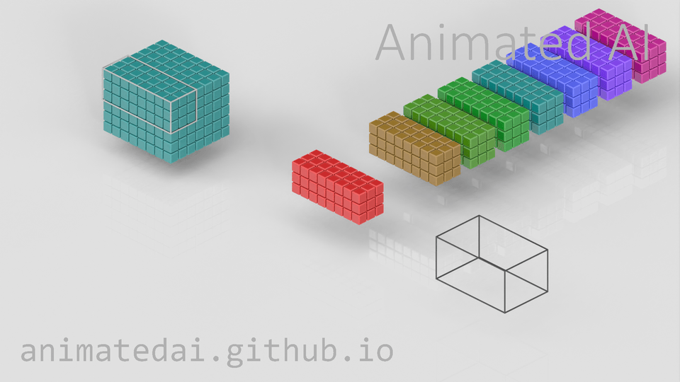

# 万物 | 炼器 从零手搓工业级旋转目标检测网络.卷2 —— 计算图、梯度与反向传播（三）


### ▸ 目录

- [2.3.1 基础聚灵阵法：Conv2d、局部视野与通道裂变](#section-001)
- [2.3.2 空间浓缩与全局视野](#section-002)
- [2.3.3 FPN 多尺度动机：大小目标需要不同尺度特征图](#section-003)
- [2.3.4 微尘重聚与灵脉交融：上采样 + Concat](#section-004)

---

## 2.3 聚灵提纯与灵力回溯 ── 卷积、下采样、上采样

在 2.2 节中，我们已经认识了图像张量最常见的形态：

也就是：

> 一批图像，多少张；
> 每张图像，多少通道；
> 每个通道，高多少、宽多少。

接下来问题来了，神经网络中的模块（通常称之为层），到底是怎么改变这些张量形态的？

在目标检测网络中，我们会反复遇到这些操作：

> Conv2d 卷积：提取局部特征，改变通道数
> 
> Downsample 下采样：缩小 H 和 W，扩大视野，YOLO中常用stride=2的卷积实现
> 
> Upsample 上采样：放大 H 和 W，方便融合高低层特征
> 
> Concat 拼接：把不同来源的特征合并到一起

这一节，我们从最基础的 nn.Conv2d 卷积层开始，看看这些操作究竟怎样改变\[B,C,H,W]，并一步步搭建出目标检测网络中“多尺度特征融合结构”的基本雏形。

这个多尺度特征融合结构通常也被称为特征金字塔网络FPN。

<a id="section-001"></a>

### 2.3.1 基础聚灵阵法：Conv2d、局部视野与通道裂变

在第1卷中，我们直接使用了nn.Conv2d(...)，当时我们只是把它当成一个现成零件。现在，是时候把这个零件拆开看看了。

**1、卷积层和全连接层的区别？**

在2.1节里，我们已经认识了神经元最基本的计算方式：

$$
z = w_1\cdot x_1 + w_2\cdot x_2 + ... + b
$$

再经过激活函数：

$$
y = \mathrm{ReLU} (z)
$$

这里使用的激活函数是ReLU，当然也可以使用其他激活函数。

如果是nn.Linear这样的全连接层，一个神经元通常会接受完整输入。

比如输入有 1000 个数字，那么一个全连接层的每个神经元都会接受这所有1000个数字作为输入，当然，每个输入要对应一个独立的权重w，所以这个全连接的每个神经元就有1000个权重。它会把所有输入数字都看一遍，然后计算输出。

但是图像和单纯的数字不太一样。

图像有上下左右，有边缘、纹理、角点、颜色变化、目标轮廓。如果我们把整张图像直接“拍扁”成一长串数字，就像把一幅画剪成碎纸条再塞进袋子里，原来的空间关系就被打乱了。

卷积层的思路更像人看图：不一口吞掉整张图，而是拿一个小窗口，一块一块地看。这个“小窗口”，就是卷积核。卷积核每次只看图像上的一小块区域，但会在整张图上移动巡逻。

这个被卷积核看到的小区域，叫****局部感受野****。

所以，卷积层和普通全连接层最大的区别是：全连接层通常看完整输入；卷积层每次只看局部区域，并且在图像上滑动复用。

**2、卷积核：一个会滑动的模式探测器**

一个“3×3”大小的卷积核，可以先想象成一个“3×3”的小矩阵：

$$
\begin{bmatrix}
w_{11} & w_{12} & w_{13} \\
w_{21} & w_{22} & w_{23} \\ 
w_{31} & w_{32} & w_{33}
\end{bmatrix}
$$

它会贴到图像上的某个“3×3”小区域上：

```text
x11 x12 x13
x21 x22 x23
x31 x32 x33
```

然后做一件很朴素的事：对应位置相乘，然后全部加起来，在加上一个偏置量b。也就是：

$$
\begin{aligned}
z ={}& x_11\cdot w_11 + x_12\cdot w_12 + x_13\cdot w_13 \\
&+ x_21\cdot w_21 + x_22\cdot w_22 + x_23\cdot w_23 \\
&+ x_31\cdot w_31 + x_32\cdot w_32 + x_33\cdot w_33 \\
&+ b
\end{aligned}
$$

这里有几个关键点：输入局部区域有 9 个数，卷积核有 9 个权重，9 个输入值和 9 个权重一一相乘，所有乘积加起来再加上偏置 b，最后得到 1 个输出值。也就是说：图像上的一个 3×3 小区域，经过一次卷积计算，会变成输出特征图上的一个 1×1 数值。

这个输出数值可以理解成，这个局部区域有多像卷积核对应的模式。

所以，卷积核本质上是一个“模式探测器”。它滑到哪里，就检查哪里。

**3、一个更通俗的模式探测示例：寻找明暗交界线**

一个卷积核可以在输入图像中寻找某种特定的局部模式。这个模式可以是明暗交界线，可以是斜线纹理，可以是颜色变化，也可以是更复杂的局部结构。

卷积核是如何寻找一个特定模式的呢？

我们用“明暗交界线”这个模式来做个例子。假设图像中有这样一块“3×3”区域：

```text
1 5 9
1 5 9
1 5 9
```

可以把数字理解成亮度。数字小表示暗，数字大表示亮，所以这块区域视觉上看大概是左边暗，中间一般，右边亮。人眼一看就知道，这块区域里可能存在一条竖着的明暗分界线。

现在我们设计一个卷积核，让它专门比较“右边”和“左边”的亮度：

$$
\begin{aligned}
&-1 & 0 & 1 \\
&-1 & 0 & 1 \\
&-1 & 0 & 1
\end{aligned}
$$

这个卷积核在图像上要做的操作现在很清晰，根据我们刚刚介绍的卷积操作，就是：

> 左列乘 -1
> 
> 中列乘 0
> 
> 右列乘 +1

把这个卷积计算的过程写出来就是：

$$
\begin{aligned}
&1\cdot (-1) + 5\cdot 0 + 9\cdot 1 \\
&+ 1\cdot (-1) + 5\cdot 0 + 9\cdot 1 \\
&+ 1\cdot (-1) + 5\cdot 0 + 9\cdot 1 \\
&= -1 + 0 + 9 \\
&-1 + 0 + 9 \\
&-1 + 0 + 9 \\
&= 24
\end{aligned}
$$

输出结果是24。

如果图像中有另一块“3×3”的区域，不存在明暗交界，比如：

```text
5 5 5
5 5 5
5 5 5
```


再用同一个卷积核进行卷积计算：

$$
\begin{aligned}
&5\cdot (-1) + 5\cdot 0 + 5\cdot 1 \\
&+ 5\cdot (-1) + 5\cdot 0 + 5\cdot 1 \\
&+ 5\cdot (-1) + 5\cdot 0 + 5\cdot 1 \\
&= 0
\end{aligned}
$$

输出0。

如果图像中还有第3块“3×3”的区域，存在另一种形式的明暗交界，比如：

```text
9 5 1
9 5 1
9 5 1
```

再用同一个卷积核进行卷积计算：

$$
\begin{aligned}
&9\cdot (-1) + 5\cdot 0 + 1\cdot 1 \\
&+ 9\cdot (-1) + 5\cdot 0 + 1\cdot 1 \\
&+ 9\cdot (-1) + 5\cdot 0 + 1\cdot 1 \\
&= -24
\end{aligned}
$$

输出-24。

我们可以看出，存在纵向明暗交界的区域，经过该卷积核进行卷积计算后，结果的绝对值大（24），我们可以理解为这个卷积核对“纵向明暗交界”这个模式反应强烈，不存在纵向明暗交界的区域，得出值的绝对值就小（0），即反应不强烈。这就是卷积核的直观作用，把一个局部区域变成一个数值，这个数值可以粗略理解为：当前区域与这个卷积核所偏好的局部模式有多匹配。

卷积核中不同的权重组合，决定了它会对什么样的模式产生较强响应，有的卷积核可能对明暗边界响应强烈；有的卷积核可能对斜线纹理响应强烈；有的卷积核可能对颜色组合响应强烈；随着网络加深，后续卷积层会组合前面已经提取出的各种特征，因此某些深层特征通道或特征单元可能对机翼局部、车辆部件等更复杂的特征组合产生较强响应。

要注意，卷积核的“大小”和卷积核里的“数值”不是一回事。卷积核的大小是几乘几，比如3×3、5×5，这是在定义网络结构时手工设定的超参数。但卷积核里面那些具体数字，也就是权重，不是我们手动填写的。它们通常先被随机初始化，然后在训练过程中，通过我们之前介绍的反向传播（loss.backward()）和 优化（optimizer.step()）一点点调整出来。

模型训练的实质之一，就是在训练过程中不断调整这些卷积核里的权重和偏置，让它们逐渐变成对当前任务有用的模式探测器。有的卷积核可能学会关注边缘，有的关注纹理，有的关注颜色变化，有的关注局部形状。不是我们提前告诉它“你去看边缘”，而是它在大量数据和反复纠错中，自己慢慢炼出来的。

这就是卷积层的炼器奥义：卷积核不是天生懂图像，而是在一次次挨 Loss 的“毒打”中学会了看图。

**4、多通道卷积**

前面为了方便说明，我们假设输入是单通道图像，也就是一张灰度图。但真实彩色图像通常是RGB三通道，输入形状：\[B, 3, H, W]，这里的“3”表示：

```text
R 通道
G 通道
B 通道
```

这时候，一个卷积核就不能只是一张“3×3”小纸片了。因为输入有 3 个通道，所以卷积核也必须有 3 个通道。也就是说，对于RGB 输入，一个“3×3”卷积核实际上长这样：

$$
\begin{aligned}
&R 通道上的 3\times 3 权重：9 个数 \\
&G 通道上的 3\times 3 权重：9 个数 \\
&B 通道上的 3\times 3 权重：9 个数
\end{aligned}
$$

总共3 × 3 × 3 = 27 个权重。为什么是 27 个？因为输入图像（RGB图像）的一个局部窗口不是平面的“3×3”，而是一个具有27 个输入值的小立方体：

$$
\begin{aligned}
&R 通道：3\times 3 \\
&G 通道：3\times 3 \\
&B 通道：3\times 3
\end{aligned}
$$

为了把这27个输入值通过卷积计算压成 1 个输出值，卷积核也要准备27个权重，与它们一一对应相乘，再全部加起来。

所以，对于标准卷积来说，一个卷积核的输入通道数，必须等于输入张量的通道数。输入是3通道，卷积核就需要有3层（通道）。输入是16通道，卷积核就有16层（通道）。输入是64通道，卷积核就有64层。

这一点非常重要。

**5、滑动：同一个卷积核在整张图上巡逻**

卷积核不会只看一个地方。它会从左到右、从上到下，在图像上移动。每移动到一个新的位置，就对当前位置的小窗口做一次卷积计算，输出一个数。

我们仍然通过单通道的图像来说明，比如一张图像,每个像素用一个小方格表示，可以简单画成：

> □ □ □ □ □ <br>
> □ □ □ □ □ <br>
> □ □ □ □ □ <br>
> □ □ □ □ □ <br>
> □ □ □ □ □ <br>

一个“3×3”卷积核第一次看左上角，和输入图像左上角的9个数值进行卷积计算：

> ■ ■ ■ □ □ <br>
> ■ ■ ■ □ □ <br>
> ■ ■ ■ □ □ <br>
> □ □ □ □ □ <br>
> □ □ □ □ □ <br>

然后向右移动一个像素位置，继续进行卷积计算：

> □ ■ ■ ■ □ <br>
> □ ■ ■ ■ □ <br>
> □ ■ ■ ■ □ <br>
> □ □ □ □ □ <br>
> □ □ □ □ □ <br>

每看一个局部窗口，就进行卷积计算并输出一个数。当卷积核滑动到最右端时，它会回到最左边，向下滑动一个像素，继续从左向右滑动进行卷积计算。

> □ □ □ □ □ <br>
> ■ ■ ■ □ □ <br>
> ■ ■ ■ □ □ <br>
> ■ ■ ■ □ □ <br>
> □ □ □ □ □ <br>

这里我们说“向右移动一个像素位置”，这里的“一个像素”其实已经涉及到卷积中的stride参数，\`stride\` 表示卷积窗口每次移动时，窗口起点前进多少个像素位置。本节我们先使用stride = 1，也就是卷积核每次移动1个像素位置，细细地扫完整张图。\`stride\` 的详细影响，我们会在 2.3.2 下采样部分展开讲。

对于3通道的图像，或者多通道的其他数据，卷积核也具有相同的通道数，并在图像上滑动计算，用一个可视化的图像演示就是这样的。

<p align="center">
  
</p>

这个动图来自于<https://animatedai.github.io/>，非常准确形象的演示了卷积操作。


**6、权重共享**

卷积层还有一个非常重要的特点，同一个卷积核滑到不同位置时，用的是同一套权重。这叫**权重共享**。

这件事非常合理。如果一个卷积核学会了识别“竖直明暗交界线”，那么它不应该只会在图像左上角识别，也应该能在右下角识别。就像你拿着同一个放大镜检查整张图。放大镜本身不变，只是位置在变。

权重共享带来两个好处，第一，参数量大大减少；第二，同一种模式可以在图像任何位置被发现。

这就是卷积层特别适合图像任务的根本原因。

**7、通道裂变：Conv2d(3, 16, 3) 到底做了什么？**

来看一个具体卷积层：

```python
conv = nn.Conv2d(
    in_channels=3,
    out_channels=16,
    kernel_size=3,
    stride=1,
    padding=1
)
```

这段代码定义了一个卷积层，它的意思是：输入有 3 个通道，输出要生成 16 个通道，每个卷积核的空间尺寸是3×3，卷积窗口每次移动1个像素位置，图像四周补1圈 0。

这里最容易混淆的是，这一层内部到底有多少个不同的卷积核？答案由 “out\_channels”决定。out\_channels = 16就表示这一层要生成 16 个输出通道，所以内部就有 16 个不同的卷积核。如果写成：

```python
nn.Conv2d(3, 32, 3)
```

那就是 32 个卷积核。如果写成：

```python
nn.Conv2d(3, 64, 3)
```

那就是 64 个卷积核。

“out\_channels”参数设定为多少，就有多少个卷积核，也就会产生多少个输出通道。

为什么一个卷积核只能生成一个输出通道？因为一个卷积核在某个空间位置上，只会把当前局部区域压成一个数字。以 RGB 输入为例：

> 输入局部区域：\[3, 3, 3]，一共 27 个数
> 当前这个卷积核：\[3, 3, 3]，一共 27 个权重

计算过程是：27个输入值和27个权重逐个相乘，把27个乘积全部加起来，再加1个偏置，得到1个输出值。

这只是一个位置上的输出。当这个卷积核在整张图上滑动时，每个位置都会产生一个数。所有位置的输出排成一张二维图 \[H, W]，这张二维图，就是一个输出通道。所以：

> 一个卷积核 → 生成一张二维特征图 → 对应一个输出通道
> 16个卷积核 → 生成16张二维特征图 → 对应16个输出通道

因此：

> \[B, 3, H, W] → Conv2d(3, 16, 3) → \[B, 16, 新H, 新W]

这就是所谓的“通道裂变”。不是说图像真的裂开了，而是网络把原来的3个通道（比如常见的RGB这3个通道），重新解释成了16种特征通道。这16个通道可能分别关注不同的视觉模式。有的关注边缘，有的关注纹理，有的关注颜色变化，有的关注局部结构。

用代码验证：

```python
import torch
import torch.nn as nn

conv = nn.Conv2d(
    in_channels=3,
    out_channels=16,
    kernel_size=3,
    stride=1,
    padding=1
)

x = torch.randn(4, 3, 256, 256)
y = conv(x)

print(f"输入: {list(x.shape)}")  # [4, 3, 256, 256]
print(f"输出: {list(y.shape)}")  # [4, 16, 256, 256]
```

参数量也很好算：权重数量 = 输出通道数 × 输入通道数 × 卷积核高 × 卷积核宽，对于刚刚的例子而言：

权重数量 = 16 × 3 × 3 × 3 = 432

偏置数量 = 输出通道数 = 16

总参数量 = 432 + 16 = 448

此时我们再回头看一下这个动图，就能够更好的理解多通道卷积操作以及通道裂变的概念了。


**8. padding=1 为什么能保持空间尺寸不变？**

刚才我们写了：

```python
nn.Conv2d(3, 16, 3, stride=1, padding=1)
```

输出形状是：

> 输入：\[B, 3, 256, 256]
> 输出：\[B, 16, 256, 256]

这里的通道数“C”从3变成了16，但是“H”和“W”仍然是 256。这就叫空间尺寸不变，所谓“空间尺寸”，对于图像而言。指的就是图像的高H 和宽 W。

为什么 \`padding=1\` 能保持空间尺寸不变？

先看一个一维小例子。假设有一排5个像素：

> □ □ □ □ □

如果用长度为3的窗口去滑动，那么窗口的合法位置只有：

```text
[1 2 3]
  [2 3 4]
    [3 4 5]
```

一共只能输出 3 个值。也就是说一排5个像素，经过长度为3的窗口操作以后，长度变成了3个像素。因为当窗口起点移动到位置3之后，就没有办法再往后移动了，窗口的大小是3，如果起点移动到位置4，窗口中就有一个数没办法与输入中的某个数对应，这是不允许的。

这时候，如果我们在一排5个像素左右两边各补一个 0：

> 0 □ □ □ □ □ 0

现在5个像素变成了7个像素，长度为3的窗口，在每次只滑动一个像素，即“stride=1”的情况下，可以滑出5个位置：

```text
[0 1 2]
  [1 2 3]
    [2 3 4]
      [3 4 5]
        [4 5 0]
```

于是输出长度又回到了 5。二维图像也是同样的道理。对于“3×3”卷积核，如果在图像四周补 1 圈 0，并且使用“stride=1”的参数进行滑动，卷积计算后输出的高度和宽度就能保持不变。

因此，输入\[B, 3, 256, 256]经过卷积层Conv2d(3, 16, 3, stride=1, padding=1)，得到的输出是 \[B, 16, 256, 256]，因为有了padding=1，所以输出的高和宽依然是256x256。

如果不加 padding，也就是 \`padding=0\`，那么高和宽将由256×256 缩小为254×254。因为“3×3”卷积核在边缘位置放不下，空间尺寸会缩小。

\`padding=1\` 的作用可以理解为，给图像四周垫一圈“假像素”，让 3×3 卷积核在 stride=1 的情况下能扫到边缘，不会缩小 H 和 W。

<a id="section-002"></a>

### 2.3.2 空间浓缩与全局视野

在 2.3.1 节中，我们使用：

$$
\begin{aligned}
kernel_{\mathrm{size}} &= 3 \\
stride &= 1 \\
padding &= 1
\end{aligned}
$$

让卷积层改变了通道数，同时保持 H 和 W 不变。但在真实的检测网络中，我们并不希望特征图一直保持“256×256”的大小。因为图像一直保持这样的大小计算会很慢，而且分辨率太高，只看局部，不容易理解全局。

目标检测网络通常会逐步缩小空间尺寸，让后面的层看到更大的范围，提取更高级的特征。这个过程叫下采样DownSample。

最常见的一种下采样方式，就是使用stride=2的卷积。

**1、stride 到底是什么？**

\`stride\` 通常翻译成“步幅”。它描述的是卷积窗口每次移动时，窗口起点前进多少个像素位置。如果stride=1，意思是窗口起点每次移动1个像素位置，它会一个位置一个位置地细致扫描。如果stride=2，意思是窗口起点每次移动2个像素位置，它会跳着扫，中间跳过一个像素。

用一维示意，stride=1，每个像素位置都可能作为窗口起点：

```text
输入位置： 1 2 3 4 5 6 7 8
窗口起点： ↑ ↑ ↑ ↑ ↑
输出数量： 多
```

stride=2。窗口起点每次前进2个像素位置：

```text
输入位置： 1 2 3 4 5 6 7 8
窗口起点： ↑   ↑   ↑   ↑
输出数量： 约减半
```

在二维图像中，横向和纵向都这样移动。所以当“stride=2”时，输出特征图的高度和宽度通常都会变成原来的一半。

来看代码：

```python
import torch
import torch.nn as nn

conv_down = nn.Conv2d(
    in_channels=3,
    out_channels=16,
    kernel_size=3,
    stride=2,
    padding=1
)

x = torch.randn(4, 3, 256, 256)
y = conv_down(x)

print(f"输入: {list(x.shape)}")  # [4, 3, 256, 256]
print(f"输出: {list(y.shape)}")  # [4, 16, 128, 128]
```

形状变化是：\[B, 3, 256, 256]→\[B, 16, 128, 128]

这里发生了两件事：

C：从 3 变成 16，由 out\_channels 决定

H：从 256 变成 128，主要由 stride=2 导致

W：从 256 变成 128，主要由 stride=2 导致

也就是说stride=2让卷积窗口在空间上跳着取位置。在高度方向上，输出位置数量减半，在宽度方向上，输出位置数量也减半，合在二维平面上，特征图位置总数约变成原来的四分之一。后续层处理的空间位置少了很多，计算量自然下降。

**2、下采样有什么好处？**

下采样看起来像是在“压缩图像”，甚至有点危险：图变小了，细节不就没了吗？

确实，下采样会损失一部分空间细节。但它也带来了三个重要好处。

第一，**减少计算量**。H 和 W 各减半，空间位置数量变成 1/4。后面的卷积层就不用在那么大的特征图上辛苦搬砖。

第二，**扩大有效视野**。特征图越往后，每个位置对应原图中越大的区域。浅层特征像近视眼，看得细，但看不远。深层特征像望远镜，看得远，但细节粗。

第三，**提取高级语义**。所谓语义，可以先粗暴理解成不只是看到“哪里亮、哪里暗、哪里有边”，而是逐渐理解“这是什么东西”。比如浅层特征可能只知道：这里有一条边、这里有一块纹理、这里有一段颜色变化，更深层的特征可能逐渐知道：这像飞机机翼、这像船体边缘、这像车辆轮廓、这像跑道标记。再通俗一点理解，低级特征看见笔画，高级语义认出这是一个字。目标检测不仅要知道图像中哪里有变化，还要知道这到底是什么目标，它大概在哪里以及它属于哪一类？

这就是深层语义的重要性。

**3、三次下采样会发生什么？**

在第 1 章的简单检测网络中，我们多次使用“stride=2”卷积。

假设输入是\[B, 3, 256, 256]，经过三次下采样：

```text
输入 [B, 3, 256, 256]
│ Conv(stride=2)
▼
[B, 16, 128, 128] ← 宽高缩小为原来的1/2
│ Conv(stride=2)
▼
[B, 32, 64, 64] ← 相比原图，宽高缩小为原来的1/4
│ Conv(stride=2)
▼
[B, 64, 32, 32] ← 相比原图，宽高缩小为原来的1/8
```

这里常说，最后这张特征图是进行了8倍下采样。

**4、下采样的代价：小目标容易消失**

也许有人会问，既然下采样这么好，那一直缩小不就行了吗？

问题来了。对于大目标，比如一艘大船、一架大型飞机，即使特征图缩小很多，它仍然可能占据多个位置。但对于小目标，比如远处的小车、小船、小型飞机，原图里可能只有十几个像素。经过多次下采样后，它在深层特征图上可能只剩不到一个位置，甚至直接被压没了。这就是目标检测里非常经典的矛盾：

> 深层特征：语义强，但空间粗
> 
> 浅层特征：空间细，但语义弱

为了解决这个矛盾，我们需要多尺度特征。这就是目前识别中非常常见的**特征金字塔网络FPN**。

<a id="section-003"></a>

### 2.3.3 FPN 多尺度动机：大小目标需要不同尺度特征图

为什么这个网络叫“特征金字塔”网络？因为这些特征图随着卷积一层层的深入进行，空间尺寸越来越小，语义层次越来越高。

> 浅层特征图像：面积大，格子多，看得细，适合小目标；
> 
> 深层特征图像：面积小，格子少，语义强，适合大目标。

比如：

> P3: 32×32，位置多，分辨率高；
> 
> P4: 16×16，居中；
> 
> P5: 8×8，位置少，但语义更强。

把这些不同尺度的特征图叠在一起看，看起来就像一座从宽到窄的金字塔，所以叫特征金字塔。

形象的表示特征金字塔，就是这样的：

想象你用无人机拍摄一片港口或者机场。图像里可能同时存在：

*   大型舰船

*   中型飞机

*   小型车辆

*   细长跑道标记

它们的大小差异非常大。如果网络只在一种分辨率上检测，就会顾此失彼。对于大目标，它在图像中占据很多像素。即使特征图被下采样到很小，它仍然能留下明显痕迹。对于小目标，它本来就只有一点点大。如果下采样太多，它在深层特征图上可能连一个独立的格子都占不满，最后和背景混在一起，变成一个很难被识别的微弱痕迹。

所以为了能够准确的检测出不同大小的目标，检测网络通常会保留多个尺度的特征图。比如输入是“256×256”，经过多次下采样后，可以得到：

| 层级 | 特征图大小 | 相对原图 stride | 适合检测 | 特点         |
| -- | ----- | ----------- | ---- | ---------- |
| P3 | 32×32 | 8           | 小目标  | 空间精度高，语义较弱 |
| P4 | 16×16 | 16          | 中目标  | 精度和语义比较均衡  |
| P5 | 8×8   | 32          | 大目标  | 语义强，空间较粗   |

这里的“P3、P4、P5”可以先理解成不同层级的特征图名称。越靠前，特征图越大，看得更细；越靠后，特征图越小，语义更强。

现在我们有了：

> P3：适合小目标，但语义弱
> 
> P4：适合中目标，比较均衡
> 
> P5：适合大目标，语义强

但还有一个问题，P3看得清小目标，却不一定知道它是什么，P5 知道高级语义，却定位不够精细。这就像P3是眼力极好的哨兵，看得清每一个小动静，但经验不足，P5是修为深厚的长老，懂大局，但看不清远处小字。

理想的情况是让 P3、 P4也获得P5的高级语义，同时保留P3、P4自己的空间精度。这就是FPN 的核心思想：

自底向上提取特征，自顶向下传递语义，横向连接融合细节。

换成人话就是先一路下采样，得到越来越深也越来越高级的语义特征，再把深层的高级语义送回浅层，让浅层既看得清，又看得懂。

<a id="section-004"></a>

### 2.3.4 微尘重聚与灵脉交融：上采样 + Concat

在 2.3.2 中，我们通过下采样把特征图越压越小：

> P3: \[B, 32, 32, 32]
> 
> P4: \[B, 64, 16, 16]
> 
> P5: \[B, 128, 8, 8]

现在我们想把P5的高级语义传给P4，甚至再传给P3。但有一个现实问题，P5的高和宽是8×8，P4是16×16，P3是32×32，尺寸不一样，没法直接融合，因为融合不是把两张图随便放在一起，而是要让空间位置能够对齐。如果使用相加融合，两个张量必须形状完全一样。

这时候就需要上采样。

上采样的目的不是凭空创造新细节。它的真正作用是把小特征图放大到和高分辨率特征图一样的空间尺寸，方便二者进行融合。比如：

> P5: \[B, 128, 8, 8]
> 
> P4: \[B, 64, 16, 16]

如果想把 P5和 P4融合，就要先把P5的空间尺寸从“8×8”放大到“16×16”。也就是：\[B, 128, 8, 8] → \[B, 128, 16, 16]。

这一步就是上采样。上采样不是为了让P5重新长出真实细节，而是为了，把深层语义搬到更高分辨率的位置上，方便和浅层细节对齐融合。

**1、nearest 上采样：把一个值复制扩充成一小块**

Nearest是最简单的上采样方式：

```python
upsample = nn.Upsample(scale_factor=2, mode='nearest')
```

代码示例：

```python
import torch
import torch.nn as nn

upsample = nn.Upsample(scale_factor=2, mode='nearest')

small = torch.randn(1, 64, 8, 8)
big = upsample(small)

print(f"输入: {list(small.shape)}")  # [1, 64, 8, 8]
print(f"输出: {list(big.shape)}")    # [1, 64, 16, 16]
```

\`nearest\` 的做法非常朴素，即把每个位置的值，复制成 2×2 的小方块，比如输入2×2：

> A B
> 
> C D

上采样后变成4×4：

> A A B B
> 
> A A B B
> 
> C C D D
> 
> C C D D

要注意，上采样不会凭空产生新信息。它只是把已有的信息铺开。就像把一张小照片放大，尺寸变大了，但原来没有的细节不会凭空出现。

但在 FPN 中，Nearest上采样已经足够有用，因为我们的目的不是“生成高清图片”，而是让深层语义和浅层细节能在同一个空间尺寸上相遇。

**2、1×1 卷积：通道对齐？**

在融合之前，我们经常会看到：

```python
nn.Conv2d(128, 64, kernel_size=1)
```

这里的卷积核尺寸是1，也就是“1×1”卷积。乍一看，“1×1”卷积很奇怪，它不看周围邻居，只看当前位置自己，那有什么用？

1×1卷积虽然不看空间邻居，却会同时读取当前位置的所有输入通道，因此它可以重新组合不同通道的信息，实现通道层面的信息融合。除此之外，1×1卷积可以用来调整通道数，也就是所谓的“通道对齐”，为什么要通道对齐？原因有三个：

第一，**控制计算量**。如果深层特征通道很多，比如P5有128个通道，直接拿去融合，后面的计算会越来越重。因此可以先用“1×1”卷积把它压到 64 个通道，即\[B, 128, 8, 8] → \[B, 64, 8, 8]。

第二，**让不同层进入统一的特征宽度**。P5 可能是 128 通道，P4 可能是 64 通道，P3 可能是 32 通道。它们来自不同层，说话的“频道数”不一样。“1×1”卷积就像一个翻译官，把它们转换到我们预先设计好的通道数。

第三，**为融合做准备**。如果后面使用“相加”融合，那么两个张量的形状必须完全一样：其中 \`C\`、\`H\`、\`W\` 都要一致才能进行相加。如果后面使用“Concat”方法拼接，通道数不一定必须一样，但提前对齐可以控制拼接后的通道规模，让网络结构更整齐，计算更可控。

假设输入是：[B, 128, 8, 8]

使用：

```python
lateral5 = nn.Conv2d(128, 64, kernel_size=1)
```

输出是：

注意：因为卷积核的大小只有1，所以这里并不需要pading，H 和 W 就能保持不变，还是 8×8。通道数C 从 128 变成 64。

所以 “1×1”卷积不是用来扩大空间视野的。它主要负责通道变换、通道压缩、通道扩展、通道对齐。

**3、Concat：灵脉续接**

现在，我们让P5先经过“1×1”卷积，再上采样：

> P5 原始： \[B, 128, 8, 8]
> 
> 卷积后： [B, 64, 8, 8]
> 
> 上采样后： \[B, 64, 16, 16]

而 P4 是

> P4： \[B, 64, 16, 16]

现在两者的空间尺寸都是“16×16”，可以融合了。如果使用 \`Concat\`，就是在通道维度上拼接：

```python
merged = torch.cat([up5, p4], dim=1)
```

形状变化是：

> up5: \[B, 64, 16, 16]
> 
> p4: \[B, 64, 16, 16]

cat 后张量的形状是：[B, 128, 16, 16]

为什么是 128？因为 \`Concat\` 是把通道摞在一起，而空间尺寸不变，可以把它想象成P5 带来了高级语义，P4 带来了中层空间细节，Concat 把两份信息装订成一本更厚的灵书。

不过，只是拼起来还不够。拼接只是把两股灵脉放到一起，还没有真正炼化，所以后面通常会接一个 \`3×3\` 卷积进行融合：

```python
fpn_conv4 = nn.Sequential(
    nn.Conv2d(128, 64, 3, padding=1),
    nn.ReLU()
)

f4 = fpn_conv4(merged)
```

形状变化是：

\[B, 128, 16, 16] → \[B, 64, 16, 16]

这个 \`3×3\` 卷积的作用是让来自 P5 的高级语义和来自 P4 的空间细节真正发生交互。

**4、FPN 的完整数据流**

现在，我们把整个过程串起来。假设输入是：

先自底向上提取特征：

| 步骤 | 操作               | 输入形状               | 输出形状               | 说明              |
| -- | ---------------- | ------------------ | ------------------ | --------------- |
| 1  | down1: Conv, s=2 | \[B, 3, 256, 256]  | \[B, 16, 128, 128] | 首次下采样           |
| 2  | down2: Conv, s=2 | \[B, 16, 128, 128] | \[B, 32, 64, 64]   | 二次下采样           |
| 3  | down3: Conv, s=2 | \[B, 32, 64, 64]   | \[B, 32, 32, 32]   | 得到 P3，stride=8  |
| 4  | down4: Conv, s=2 | \[B, 32, 32, 32]   | \[B, 64, 16, 16]   | 得到 P4，stride=16 |
| 5  | down5: Conv, s=2 | \[B, 64, 16, 16]   | \[B, 128, 8, 8]    | 得到 P5，stride=32 |

再自顶向下传递语义：

| 步骤 | 操作                 | 输入形状                          | 输出形状              | 说明      |
| -- | ------------------ | ----------------------------- | ----------------- | ------- |
| 6  | lateral5: 1×1 Conv | \[B, 128, 8, 8]               | \[B, 64, 8, 8]    | P5 通道对齐 |
| 7  | Upsample ×2        | \[B, 64, 8, 8]                | \[B, 64, 16, 16]  | P5 空间放大 |
| 8  | Cat(up5, P4)       | \[B,64,16,16] + \[B,64,16,16] | \[B, 128, 16, 16] | 拼接语义和细节 |
| 9  | fpn\_conv4         | \[B, 128, 16, 16]             | \[B, 64, 16, 16]  | 得到 F4   |
| 10 | lateral4: 1×1 Conv | \[B, 64, 16, 16]              | \[B, 32, 16, 16]  | F4 通道对齐 |
| 11 | Upsample ×2        | \[B, 32, 16, 16]              | \[B, 32, 32, 32]  | F4 空间放大 |
| 12 | Cat(up4, P3)       | \[B,32,32,32] + \[B,32,32,32] | \[B, 64, 32, 32]  | 拼接语义和细节 |
| 13 | fpn\_conv3         | \[B, 64, 32, 32]              | \[B, 32, 32, 32]  | 得到 F3   |

最终我们得到：

> F3: \[B, 32, 32, 32] 适合小目标
> 
> F4: \[B, 64, 16, 16] 适合中目标
> 
> P5: \[B, 128, 8, 8] 适合大目标

它们分别承担不同尺度的检测任务。

**5、FPN 的直觉总结**

可以把整个过程画成：

自底向上：提取越来越强的语义

```text
输入
│
▼
P3 [32, 32, 32] ← 空间细，适合小目标
│
▼
P4 [64, 16, 16] ← 折中
│
▼
P5 [128, 8, 8] ← 语义强，适合大目标
```

自顶向下：把深层语义送回高分辨率层

```text
P5 [128, 8, 8]
│
│ 1×1 Conv → Upsample
▼
Cat with P4
│
▼
F4 [64, 16, 16]
│
│ 1×1 Conv → Upsample
▼
Cat with P3
│
▼
F3 [32, 32, 32]
```

> ***修仙隐喻：** P5 是修为深厚的长老，洞察全局但不拘小节；P3 是眼力过人的哨兵，能看清每一个微小变化但不理解全局。FPN 的 Cat + Conv 就是"灵脉交融术"——让长老的智慧流入哨兵的眼睛，使哨兵既能看清细节，又能理解大局。*
