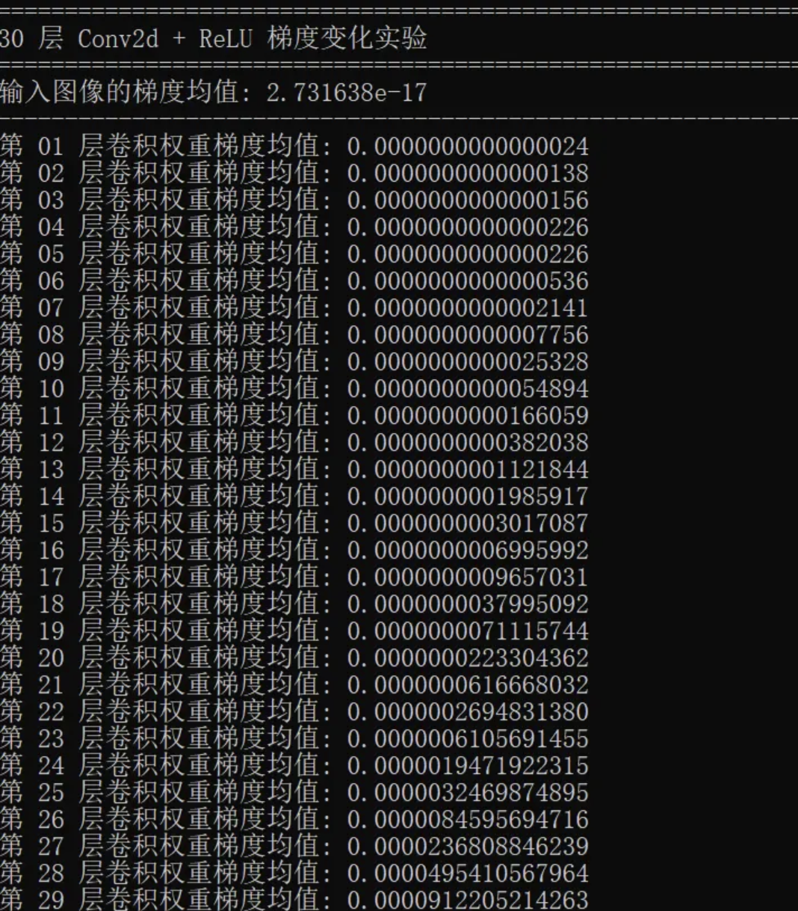
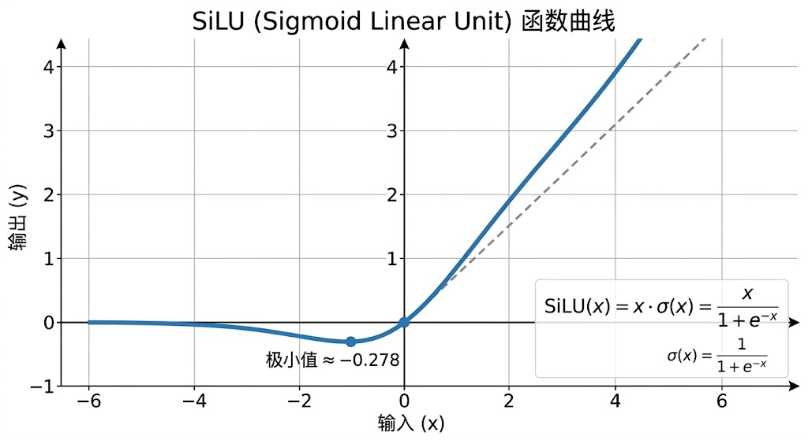
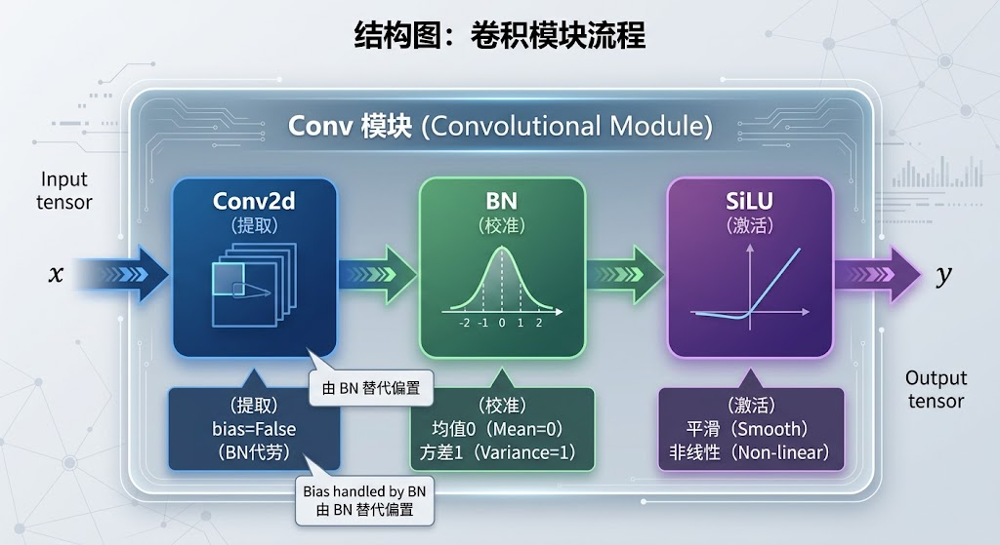
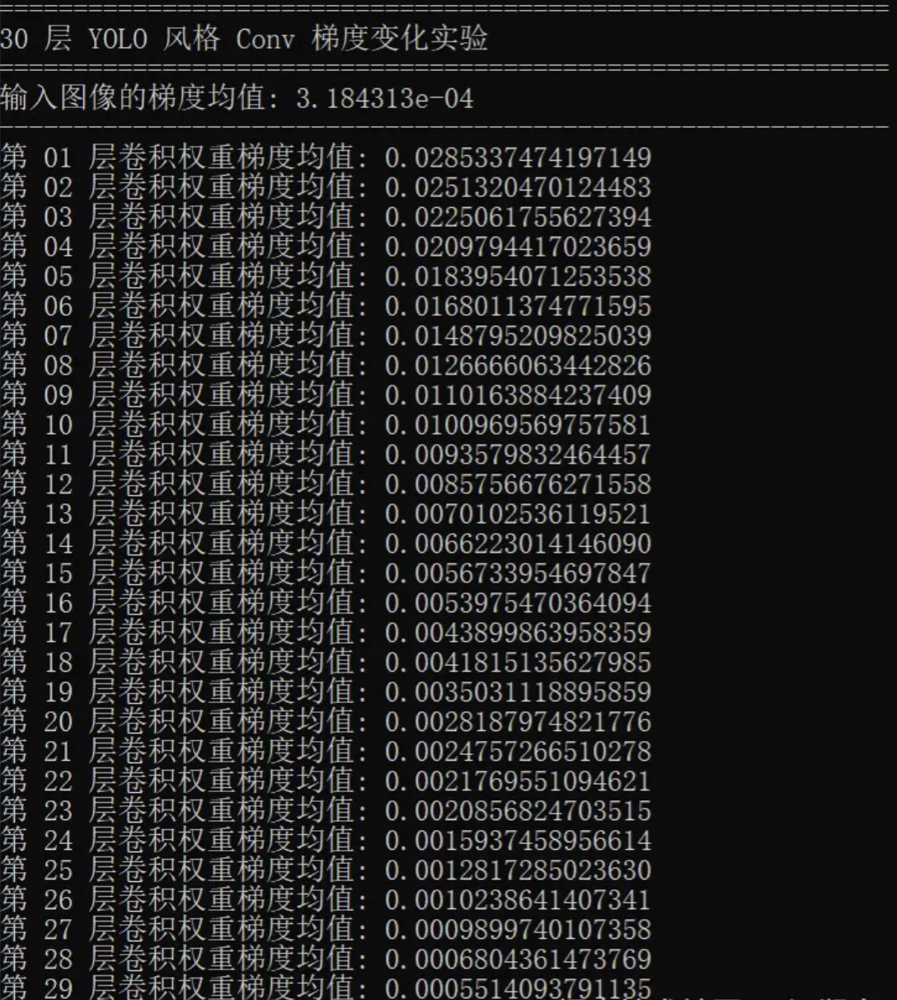

# 核心算子锻造（一）


第2卷，我们打造了一把带有多尺度 FPN 的"铁剑"，深入理解了反向传播——那条从 Loss 出发、沿计算图逆向追责的链式法则。

铁剑虽能挥砍，却有一个致命缺陷：层数一多，追责令可能就传不回去了。

## 3.1 凡铁的极限 ── 深层网络的致命诅咒

<a id="section-001"></a>

### 3.1.1 窥探深渊：一个梯度衰减的极简实验

还记得第2卷的"追责"比喻吗？Loss 像质检站一样发出追责令，沿着网络反向传递给每一层。每一层收到的梯度就是它的"改进指令"。

问题来了——如果网络有 10 层、20 层甚至 100 层呢？

根据“链式法则”，追责令每经过一层，它都要被这一层的“局部变化率”重新换算一次。这个所谓的“变化率”在数学上就是“当前层输出”对“当前层输入”的导数，它表示当前层的输入稍微变一点，输出会跟着变多少。如果这些“变化率”大多数小于 1，连乘下去很可能就会出现指数级衰减——这就是梯度消失。反过来，如果“变化率”大部分大于 1，连乘下去就可能会指数级爆炸——这就是梯度爆炸。

以早期网络常用的 Sigmoid 激活函数为例，其导数最大值只有 0.25：

$$
σ'(x) = σ(x)(1 - σ(x)) ≤ 0.25
$$

假设网络有 100 层，每层导数都是 0.25，不考虑其他因素的情况下，从最后一层传回第一层的梯度会被缩小为：

$$
0.25^{100} ≈ 6.2 \times 10^{-61}
$$

这个数字已经无限接近于0了——第一层根本收不到任何有意义的"改进指令"。

下面我们基于 PyTorch 亲眼看看这个现象。

请打开编辑器，创建文件 `ch03/main.py`，写入下面的代码：

```python
import torch
import torch.nn as nn


def gradient_experiment():
    """30 层 Conv2d + ReLU 梯度变化实验"""
    print("=" * 60)
    print("30 层 Conv2d + ReLU 梯度变化实验")
    print("=" * 60)

    # ---- 1. 搭建 30 层网络 ----

    layers_basic = []
    for i in range(30):
        c_in = 3 if i == 0 else 32
        layers_basic.append(nn.Conv2d(c_in, 32, 3, padding=1))
        layers_basic.append(nn.ReLU())

    net_basic = nn.Sequential(*layers_basic)

    # ---- 2. 构造输入 ----
    x = torch.randn(1, 3, 64, 64, requires_grad=True)

    # ---- 3. 前向传播 + 反向传播 ----
    out = net_basic(x)
    loss = out.mean()
    loss.backward()

    # ---- 4. 查看输入梯度 ----
    input_grad = x.grad.abs().mean().item()
    print(f"输入图像的梯度均值: {input_grad:.6e}")
    print("-" * 60)

    # ---- 5. 查看每一层卷积权重的梯度 ----
    conv_layer_id = 0

    for layer in layers_basic:
        if isinstance(layer, nn.Conv2d):
            conv_layer_id += 1
            grad_mean = layer.weight.grad.abs().mean().item()
            print(
                f"第 {conv_layer_id:02d} 层卷积权重梯度均值: "
                f"{grad_mean:.16f}"
            )

    print("=" * 60)


if __name__ == "__main__":
    gradient_experiment()
```

代码不长，我们按照程序的执行顺序来理解。

| **代码位置**                                   | **做了什么**                                | **直观理解**                                          |
| ------------------------------------------ | --------------------------------------- | ------------------------------------------------- |
| `layers_basic = []`                        | 创建一个空的列表                                | 模型的各层就放在这个列表里                                     |
| `for i in range(30)`                       | 通过一个循环搭建 30 组 `Conv2d + ReLU`           | 搭起一条很深的 30 工位流水线                                  |
| `c_in = 3 if i == 0 else 32`               | 第一层接收 RGB 的 3 通道，后续层统一接收 32 通道          | 第一个工位接原材料，后面的工位接上一站的半成品                           |
| `net_basic = nn.Sequential(*layers_basic)` | 把所有层串联成一个网络                             | 通过Sequential，把layers\_basic列表中的层依次构建出一个处理数据的“流水线” |
| `torch.randn(..., requires_grad=True)`     | 创建一张随机的 64×64 RGB 输入，并要求 PyTorch 记录它的梯度 | 告诉 PyTorch：这张输入也要参与“追责”                           |
| `out = net_basic(x)`                       | 完成前向传播                                  | 原材料从第 1 层一路加工到第 30 层                              |
| `loss = out.mean()`                        | 临时把最终输出的均值当作 loss                       | 给网络制造一个可以反向传播的“总责任值”                              |
| `loss.backward()`                          | 启动反向传播                                  | 质检站开始沿网络反向发送“追责令”                                 |
| `x.grad.abs().mean()`                      | 查看梯度传回输入端后还剩多大                          | 看追责令走完整条流水线后还剩多少强度                                |
| `layer.weight.grad.abs().mean()`           | 查看每一层卷积权重收到的平均梯度                        | 看每一个工位到底收到了多强的改进指令                                |

这里特别注意最后一段。`layers_basic` 中既有 `Conv2d`，也有 `ReLU`，但是只有卷积层存在可学习的 `weight` 参数，所以必须先用 `if isinstance(layer, nn.Conv2d)`筛出卷积层，再读取 `layer.weight.grad`，否则直接对 `ReLU` 访问 `weight`，程序就会报错。

运行这段代码，会看到类似下面的结果。不同 PyTorch 版本和硬件环境下，具体数值可能略有差异，但数量级和整体趋势应当比较接近：

<p align="center">
  
</p>

这里第30层靠近输出端，也就是loss反向传播的起点，第1层靠近输入端，也就是loss反向传播的终点。梯度均值的具体数值可能略有不同，但趋势很清楚：越靠前的层，梯度越微弱。第 30 层还能收到大约 `10^-4` 数量级的梯度，而第 1 层已经跌到了 `10^-15` 数量级；传回输入图像的梯度更只有 `10^-17` 数量级。

这意味着最后几层还能收到比较清楚的“追责令”，知道自己该怎么改；而最前面的卷积层收到的指令已经细若游丝。它们明明站在特征提取的第一线，却很难获得足够强的更新信号。

这就是深层网络训练困难的根源之一。

第 2 卷最后提到，在掌握目标检测网络基本骨架之后，我们不再闭门造车，而是选择一个成熟且广泛应用的旋转目标检测模型——YOLO11 OBB——作为后续持续升级的参考蓝图。

在 YOLO11 OBB 中，最基础的卷积模块不是孤零零的 `Conv2d + ReLU`，而是把卷积、归一化和激活组合在一起，构成一个更优雅、更稳定的“铁三角”组合：

> **Conv2d → BatchNorm2d → SiLU**

其中，Conv2d 负责提取局部特征；BatchNorm2d 负责稳定中间特征的数值尺度；SiLU 负责提供更平滑的非线性变换。三者配合起来，就像给深层网络装上了一套更稳定的传动系统：信号往前走得更稳，梯度往回传也更顺畅。

接下来，我们就把这个 YOLO 风格的 `Conv` 模块亲手写出来。等它写完之后，我们还会回到刚才这个 30 层梯度变化实验——其他条件全部不变，只把 `Conv2d + ReLU` 换成新的 `Conv`，看看梯度到底会发生什么。


<a id="section-002"></a>

### 3.1.2 灵力驯化：手搓 Conv2d+BN+SiLU 铁三角

我们先来打造这个“铁三角”。

在 YOLO11 中，这个“铁三角”组合通常被封装成一个基础模块，名字就叫 Conv，这是YOLO11的核心模块（算子）。

开始写代码之前，首先解释两个问题：

#### 3.1.2.1 为什么是 SiLU？

在第2卷中，激活函数我们用的是 ReLU函数（Rectified Linear Unit）：

$$
\mathrm{ReLU}(x) = \max(0, x)
$$

ReLU 的导数要么是 0（当 x < 0 时），要么是 1（当 x > 0 时）。导数为1，追责令在这里保持不变，但导数为0就很讨厌了，因为追责令在这里被彻底截断了。这就是所谓的"死神经元"问题：一旦某个神经元的输入长期为负，它就可能永远"死"了，再也学不到东西。

从这个角度而言，SiLU（也叫 Swish）是一个比ReLU更合适的激活函数：

$$
SiLU(x) = x \times σ(x) = x \times (1 / (1 + e^{-x}))
$$

它的曲线长这样：

<p align="center">
  
</p>

关键区别：

| **特性**  | **ReLU**    | **SiLU**    |
| ------- | ----------- | ----------- |
| x < 0 时 | 输出恒为0，导数恒为0 | 输出略为负，导数不为0 |
| x = 0 处 | 不可导（尖角）     | 平滑过渡        |
| 梯度截断风险  | 高（死神经元）     | 极低          |

SiLU 不像 ReLU 那样把整个 x<0 区域直接截断成 0。负输入仍可以产生平滑的非零输出，而且在大多数负值区域仍有梯度，因此梯度传播不像 ReLU 那样存在整片负半轴硬截断。这意味着即使神经元暂时"沉睡"，追责令仍然能穿透它——神经元还有机会"苏醒"。所以在深层网络中，SiLU 往往比 ReLU 更平滑，梯度传播也更柔和。

这也是 YOLO 系列基础卷积模块喜欢使用 SiLU 的原因之一。

#### 3.1.2.2 BatchNorm2d 层

前面说过，深层网络训练困难，很大一部分原因是数值（前向传播时每一层的输出值，或反向传播时的梯度值）在一层层传递时容易失控。对于一个简单堆叠的卷积网络而言：

> 第 1 层输出范围：比较正常
>
> 第 5 层输出范围：开始变大或变小
>
> 第 15 层输出范围：已经明显漂移
>
> 第 30 层输出范围：可能大得离谱，也可能小得像灰尘

这样会带来两个问题：

*   前向信号不稳定。如果特征值越来越大，后面的层会被大数值牵着走；如果特征值越来越小，后面的层接收到的信号就像快没电的手电筒，越来越暗。
*   反向梯度也不稳定。反向传播时，梯度要一层层乘回去。如果中间层的数值尺度长期失控，那么梯度也容易被连续放大或者连续缩小。

**BatchNorm2d 层**（简称BN层） 的作用，就是在每一层卷积之后，把输出特征重新拉回一个比较健康的范围，均值附近，方差适中，不过大，不过小。你可以把它理解成一个“数值稳压器”。没有 BN 的时候，每一层都可能把信号放大 3 倍、缩小 5 倍、再放大 10 倍，传到后面，数值早就面目全非。有了 BN 之后，每一层都会先说：等一下，先把这批特征拉回正常尺度，再交给下一层。

这样做有几个好处：

*   稳定前向特征，每层输入分布更稳定，后面的层不用一直适应乱飘的数据；
*   有助于缓解梯度消失，特征不会一路缩小到接近 0，梯度也更容易传回来；
*   有助于缓解梯度爆炸，特征不会一路膨胀到巨大数值，反向梯度也不容易失控；
*   提高训练容忍度，学习率可以相对大胆一些，训练过程更稳。

从反向传播角度看，BN 也参与梯度计算。它在反向时会根据当前通道的标准差来调整梯度尺度。直觉上可以理解为：这个通道的数值太散，就压一压；这个通道的数值太挤，就拉一拉。因此，梯度经过 BN 时，不再只是被前后层随意放大或缩小，而是经过了一次按方差校准的“稳压处理”。

从数学上来看，BatchNorm2d 层做的事情非常简单：它先把每一层的输出拉回到均值 0、方差 1 附近，再通过两个可以学习的参数 γ 和 β 对特征进行适当的缩放和平移。

$$
BN(x) = γ \times \frac{x - μ}{\sqrt{σ² + ε}} + β
$$

其中 μ 和 σ² 分别表示当前通道特征的均值和方差，γ 和 β 是可学习的缩放和偏移参数。关于这个公式不做过多的解释，有兴趣深入了解的可以自行查阅相关资料。

简单的说明一下为什么 BN 后面还要有 γ 和 β。

BN 把特征变成均值 0、方差 1，在很多情况下会显得太死板，为了调节这种情况，在 BN 后面又加了两个可学习参数γ 和 β，其中，γ控制缩放，β控制平移。这两个参数的意思是，我先把特征拉回标准范围；如果网络觉得某个通道应该更强，再用 γ 放大；如果网络觉得某个通道整体应该偏一点，再用 β 平移。也就是说，BN 不是强行把所有特征永远锁死在标准正态分布里。它只是先把混乱的数值整理干净，再把调整权交还给网络自己。

> 💡 **关键洞察**
>
> 如果说每层网络是一个"中转站"，那么：
>
> *   没有BN的中转站：信号经过时被随意放大或缩小，传了10站后面目全非。
> *   有BN的中转站：每个中转站都有一台"标准化校准器"，把信号拉回标准强度后再转发，因此连续传播时更不容易出现严重的数值漂移。
> *   SiLU 则像是给每个中转站装了一个"灵活度旋钮"——它不会像 ReLU 那样粗暴地把负信号归零（断路），而是温柔地压低负信号、放大正信号，让信号通道始终畅通。

#### 3.1.2.3 Conv 的实现

在写 Conv 类之前，我们需要先实现一个小工具函数——autopad。

**1、autopad 自动填充**

在前2卷，我们讨论过卷积操作会改变输出特征图的空间尺寸，比如一张 64 × 64 的图，如果直接用 3 × 3 卷积，且不加 padding，输出会变成62 × 62。

如果网络里每经过一层卷积，特征图就小一圈，那么几十层之后，图可能越卷越小。更麻烦的是，目标检测模型里有很多特征融合操作，比如上采样、拼接、跨层连接。它们要求不同路径来的特征图尺寸能对得上。如果尺寸对不上，就会直接报错。这就像两块积木尺寸不合，硬怼是怼不上的。

所以我们通常希望，stride = 1 时，卷积前后特征图尺寸不变，stride = 2 时，特征图尺寸大约减半，也就是，特征图的空间尺寸变化，主要跟stride参数相关，这样就方便我们控制各层输出特征图的大小。要实现这个功能，就需要在每次卷积之前，给卷积层设置合适的padding参数。这个参数每次都手动计算，显然是不合适的。

所以我们需要autopad。

autopad 的作用是根据卷积核大小，自动计算合适的 padding，使得卷积输出的空间尺寸等于 输入尺寸除以 stride。

以下是 autopad 方法的实现，请补充导入必须的依赖，并main.py中输入以下代码：

```python
def autopad(k, p=None, d=1):
    """
    自动计算padding使得卷积输出尺寸 = 输入尺寸 / stride。
    对标: ultralytics/nn/modules/conv.py::autopad
    """
    if d > 1:
        k = d * (k - 1) + 1  # 膨胀卷积的等效核大小
    if p is None:
        p = k // 2            # 'same' padding
    return p
```

autopad方法中各变量的含义，对数学不感兴趣的不必深究，大致了解一下即可：

| **代码/参数**         | **含义**              | **示例或作用**                               |
| ----------------- | ------------------- | --------------------------------------- |
| `k`               | 卷积核大小（kernel size）  | 比如 3 表示 3×3 卷积核                         |
| `p`               | padding（填充）         | 在图像四周补零                                 |
| `d`               | dilation（膨胀系数）      | `d=1` 是普通卷积                             |
| `d * (k - 1) + 1` | 计算膨胀卷积的等效核大小        | `d=2, k=3` 时，等效核大小为 5                   |
| `k // 2`          | 用等效核大小的一半计算 padding | 3×3 核对应 `padding=1`，5×5 核对应 `padding=2` |

autopad 方法统一了卷积尺寸规则，让模型结构搭起来更稳、更干净、更不容易出错。

YOLO11库的官方源码还处理了 k 为列表的情况（用于非正方形卷积核），我们这里简化为只处理整数。

**2、Conv算子的代码实现**

有了 autopad 方法，我们终于可以开始写 YOLO 风格的 Conv 模块了。

**Conv 算子**是整个 YOLO 网络中出现频率最高的模块——后续大量复杂组件都以它为基石。请在main.py中输入以下代码：

```python
class Conv(nn.Module):
    """
    标准卷积三件套: Conv2d + BatchNorm2d + SiLU
    对标: ultralytics/nn/modules/conv.py::Conv
    """

    default_act = nn.SiLU()  # YOLO 的默认激活函数

    def __init__(self, c1, c2, k=1, s=1, p=None,
                 g=1, d=1, act=True):
        super().__init__()
        self.conv = nn.Conv2d(
            c1, c2, k, s,
            autopad(k, p, d),
            groups=g, dilation=d, bias=False
        )
        self.bn = nn.BatchNorm2d(c2)
        self.act = (
            self.default_act if act is True
            else act if isinstance(act, nn.Module)
            else nn.Identity()
        )
        
    def forward(self, x):
        return self.act(self.bn(self.conv(x)))
```

让我们逐行拆解：

*   类级属性

```python
default_act = nn.SiLU()
```

这是一个类级别的属性，所有 Conv 实例共享同一个 SiLU。为什么放在类级别？因为 SiLU 没有可学习参数，不需要每个实例都创建一份。

*   构造函数 \_*init*\_

构造函数参数：

| **参数** | **默认值** | **含义**                                  |
| ------ | ------- | --------------------------------------- |
| `c1`   | 无       | 输入通道数，比如 RGB 图像的 3 通道                   |
| `c2`   | 无       | 输出通道数，也就是希望提取多少组特征                      |
| `k`    | 1       | 卷积核大小，如 1×1、3×3、5×5                     |
| `s`    | 1       | 步长，`stride=2` 时空间尺寸通常减半                 |
| `p`    | `None`  | padding；为 `None` 时由 `autopad` 自动计算      |
| `g`    | 1       | 分组数，`g=1` 表示普通卷积                        |
| `d`    | 1       | 膨胀系数，`d=1` 表示普通卷积                       |
| `act`  | `True`  | `True` 使用 SiLU；传入模块时使用自定义激活；`False` 不激活 |

核心三行——铁三角的组装：

```python
self.conv = nn.Conv2d(c1, c2, k, s, autopad(k, p, d),
                      groups=g, dilation=d, bias=False)
```

基础卷积层，注意，这里 `bias=False`。因为后面紧跟自带可学习偏移参数 β 的 BN，Conv2d 的 bias 可以由 BN 的偏移项表达，因此通常没有必要再保留一组冗余的卷积偏置参数。

```python
self.bn = nn.BatchNorm2d(c2)
```

BN层，BN 层作用在输出通道维度上——c2 个通道，每个通道有独立的 μ、σ、γ、β。

```python
self.act = (self.default_act if act is True
            else act if isinstance(act, nn.Module)
            else nn.Identity())
```

构建激活函数，这行处理了三种情况：

> `act=True` → 使用默认的 SiLU；
>
> `act=nn.LeakyReLU()` → 使用传入的自定义激活函数；
>
> `act=False` → 使用 Identity，相当于不做激活。

*   前向传播方法——三步流水线：

```python
def forward(self, x):
    return self.act(self.bn(self.conv(x)))
```

数据流：x → Conv2d → BN → SiLU → 输出

三个操作依次嵌套调用，张量从最内层的 self.conv(x) 开始，经过 BN 归一化，最后被 SiLU 激活。

对标源码： `ultralytics/nn/modules/conv.py`。我们的实现在核心结构上与官方版本一致——这不是巧合，而是我们有意为之：保持代码的一对一映射。

Conv 模块的结构图：

<p align="center">
  
</p>

<a id="section-003"></a>

### 3.1.3 再探深渊：换上“铁三角”后的梯度

现在 `Conv` 已经写完了，我们终于可以回来回答前面留下的问题：

> 如果其他条件全部不变，只把原来的 `Conv2d + ReLU` 换成 `Conv2d + BatchNorm2d + SiLU`，梯度会发生什么？

为了让这个对比尽可能直观，我们保持下面这些条件完全一致：

| **项目**  | **第一次实验**         | **第二次实验**            |
| ------- | ----------------- | -------------------- |
| 网络深度    | 30 层              | 30 层                 |
| 输入尺寸    | `[1, 3, 64, 64]`  | `[1, 3, 64, 64]`     |
| 中间通道数   | 32                | 32                   |
| 卷积核     | 3×3               | 3×3                  |
| stride  | 1                 | 1                    |
| loss    | `out.mean()`      | `out.mean()`         |
| 反向传播    | `loss.backward()` | `loss.backward()`    |
| 唯一的结构变化 | `Conv2d + ReLU`   | `Conv2d + BN + SiLU` |

在前面的 `Conv` 类已经定义好的前提下，把下面这个函数继续写进 `main.py`：

```python
def gradient_experiment_yolo_conv():
    """30 层 YOLO 风格 Conv 梯度变化实验"""
    print("=" * 60)
    print("30 层 YOLO 风格 Conv 梯度变化实验")
    print("=" * 60)

    # ---- 1. 搭建 30 层网络 ----

    layers_yolo = []
    for i in range(30):
        c_in = 3 if i == 0 else 32
        layers_yolo.append(Conv(c_in, 32, k=3, s=1))

    net_yolo = nn.Sequential(*layers_yolo)

    # ---- 2. 使用与第一次实验相同规则生成输入 ----
    x = torch.randn(1, 3, 64, 64, requires_grad=True)

    # ---- 3. 前向传播 + 反向传播 ----
    out = net_yolo(x)
    loss = out.mean()
    loss.backward()

    # ---- 4. 查看输入梯度 ----
    input_grad = x.grad.abs().mean().item()
    print(f"输入图像的梯度均值: {input_grad:.6e}")
    print("-" * 60)

    # ---- 5. 查看每个 Conv 模块内部卷积权重的梯度 ----
    for i, layer in enumerate(layers_yolo, start=1):
        grad_mean = layer.conv.weight.grad.abs().mean().item()
        print(
            f"第 {i:02d} 层卷积权重梯度均值: "
            f"{grad_mean:.16f}"
        )

    print("=" * 60)
```

为了同时运行前后两次实验，可以把文件最后改成：

```python
if __name__ == "__main__":
    gradient_experiment()
    print()
    gradient_experiment_yolo_conv()
```

运行后，第二组实验会得到类似下面的结果：

<p align="center">
  
</p>

把两次实验中几个有代表性的层放在一起看：

| **观察位置**     | **Conv2d + ReLU** | **YOLO 风格 Conv** |
| ------------ | ----------------: | ---------------: |
| 输入图像梯度均值     |      `10^-18左右量级` |     `10^-04左右量级` |
| 第 1 层卷积权重梯度  |      `10^-16左右量级` |     `10^-02左右量级` |
| 第 5 层卷积权重梯度  |      `10^-15左右量级` |     `10^-02左右量级` |
| 第 10 层卷积权重梯度 |      `10^-13左右量级` |     `10^-03左右量级` |
| 第 15 层卷积权重梯度 |      `10^-11左右量级` |     `10^-03左右量级` |
| 第 20 层卷积权重梯度 |      `10^-09左右量级` |     `10^-03左右量级` |
| 第 25 层卷积权重梯度 |      `10^-07左右量级` |     `10^-03左右量级` |
| 第 30 层卷积权重梯度 |      `10^-04左右量级` |     `10^-04左右量级` |

第一次实验中，第 30 层还有大约 `10^-4` 数量级的梯度，但越向前走，梯度就越小，第 1 层已经衰减到 `10^-16` 左右。网络最前面的层几乎收不到有效的“追责令”。换成 YOLO 风格的 `Conv` 以后，情况明显不同。30 层网络中，各层卷积权重的梯度仍然会随着网络位置发生变化，但前面几层没有再一路衰减到接近 0；传回输入端的梯度也从 `10^-18` 数量级提高到了 `10^-4` 数量级。

两次试验表明：

> **完整的 YOLO 风格 `Conv` 在这个 30 层极简网络中显著改善了梯度传播。**

这里还有一个有意思的现象：换成 YOLO 风格的 Conv 后，靠近输入端的几层梯度甚至比最后几层更大。这是因为我们打印的是各层卷积**权重的梯度**，它不仅取决于后方传来的梯度，还与当前层输入特征以及 BN 对梯度尺度的重新调整有关。

加入 BN 后，梯度在反向传播过程中会被不断重新调整尺度，因此不再是简单地一层层变大或一层层变小。有了 BN 以后，各层梯度通常不会呈现线性增加或线性减少的规律，有的层大一些、有的层小一些都是正常现象，关键是梯度不要一路衰减到接近 0，也不要不断放大到失控。

新的`Conv算子`已经打造完成，接下来该做什么了呢？

